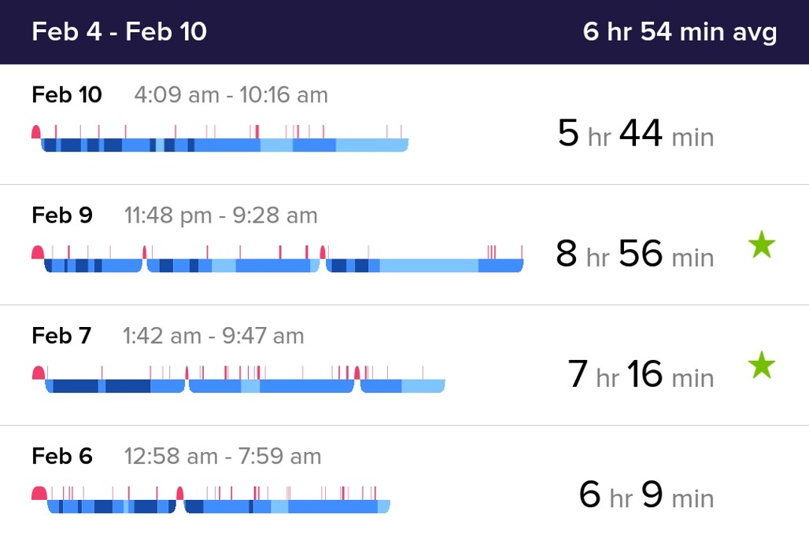
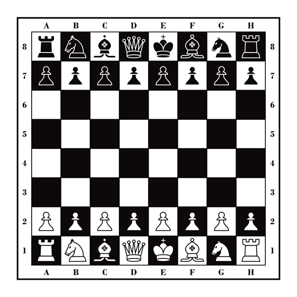
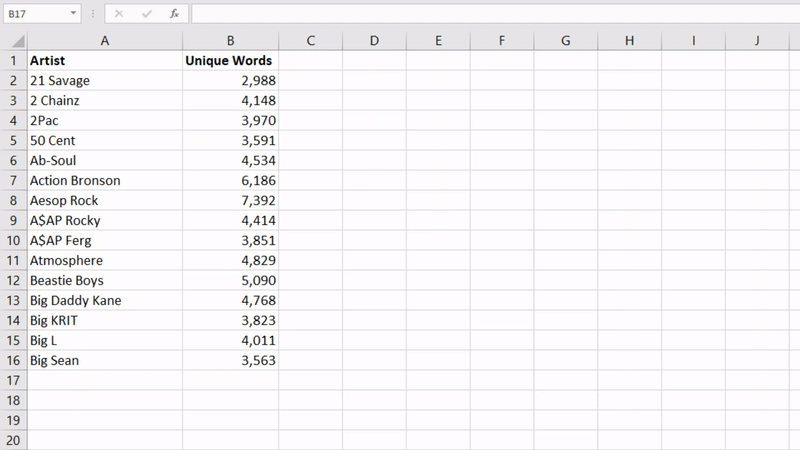
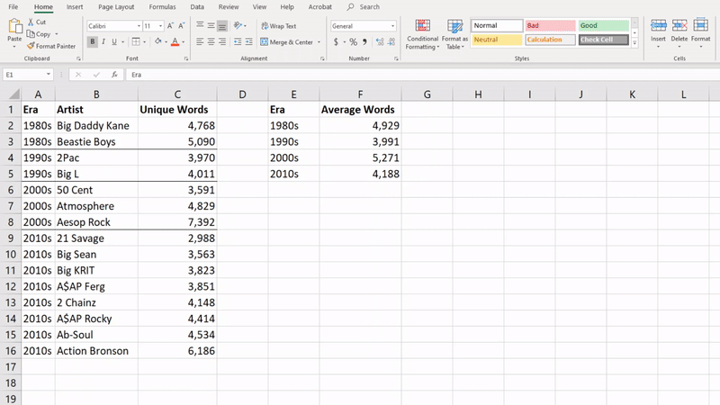

```{r include = FALSE}

setwd("~/CASA Quant Curriculum")

library(knitr)
library(dplyr)
library(scales)
library(GGally)
library(scales)
library(readxl)
library(ggplot2)
library(kableExtra)

knitr::opts_chunk$set(echo = FALSE,
                      warning = FALSE,
                      message = FALSE,
                      optipng = '')

```

<br>
<br>
<br>

# Welcome

Welcome to 
*Get the Picture? An Introduction to Efficient, Effective, & Elegant Data Visualization*, 
a part of the Summer 2020 workshop series for the 
[Center for the Advancement of Students & Alumni (CASA)](https://casa.gsu.edu/)
at [Georgia State University](https://www.gsu.edu/).

<br>
<br>

::: {.video}

#### <span style="color: #FFFFFF;">Welcome & Orientation</span>

<br>

Watch the following video for a welcome from your instructor and orientation to 
this workshop.

<br>

<center>

::: {.graph}

<div class="player">
<iframe width="672" height="378" src="https://www.youtube.com/embed/6zzW96eq-Ro?rel=0&modestbranding=1&autohide=1&showinfo=0" frameborder="0" allow="accelerometer; autoplay; encrypted-media; gyroscope; picture-in-picture" allowfullscreen></iframe>
</div>

:::

</center>

:::

<br>
<br>
<br>

## About This Workshop

This workshop will teach you fundamental concepts in data visualization,
one of the most powerful tools in analytics, statistics, and data science
for conveying big ideas and sophisticated information to broad audiences.
You'll learn how to prepare data for the most appropriate graphics in
popular spreadsheet software like *Microsoft Excel* and *Google Sheets*.

<br>

What's more, you'll also learn the best types of visualizations to depict 
different kinds of data and how to refine these graphics to convey those data 
quickly (*efficiently*), clearly (*effectively*), and in a manner
pleasing to the eye (*elegantly*).

<br>

While not every career path makes heavy use of these techniques and tools nor 
requires visualizing data from scratch, basic data visualization 
literacy is critical for every career, as well as the variety of ways,
both subtle and explicit, that we consume data visualization in our daily lives.

<br>
<br>

#### Workshop Objectives

By the end of this workshop, you should have a basic understanding of the following:

<br>

1. Working with data tables in common spreadsheet software

2. How to format data as a foundation for visualization

3. Basic functions for preparing data for visualization

4. Selecting and creating data visualizations

5. Refining data visualizations for clarity and efficiency

<br>
<br>

#### About Our Data

Throughout this workshop, you'll practice preparing and visualizing myriad 
hip hop data, including the breadth of vocabulary among various artists, the 
greatest Hip Hop tracks of all time, and the number of platinum Hip Hop albums 
by state. You can learn more about these data in the following sources:

<br>

* Brown, T.M. (2020). [**"The Greatest Hip Hop Songs of All Time"**](https://www.bbc.com/culture/article/20191007-the-greatest-hip-hop-songs-of-all-time). *BBC Music*.

* Daniels, M. (2019). [**"The Largest Vocabulary in Hip Hop"**](https://pudding.cool/projects/vocabulary/index.html). *The Pudding*.

* Garrison, L. (2018). [**"Platinum Hip Hop Albums by City"**](https://data.world/gmoney/platinum-hiphop-albums-by-city). *DJ Booth*.

<br>
<br>

#### About Your Instructor

This workshop was created by [Jamison Crawford, MPA](https://www.linkedin.com/in/jamisoncrawford). 
He is an institutional researcher at *Georgia State University's* 
*Graduate School* and *Center for the Advancement of Students & Alumni (CASA)*, 
as well as a professor of data science for policy analytics at *Georgia State's* 
*Andrew Young School* and *Arizona State University's Watts College*. 
He's designed instructional material and taught adult learners for nearly ten years.

<br>
<br>

::: {.tip}

#### <span style="color: #FFFFFF;">Optional Chapters</span>

<br>

**Chapters 1-2 and their applied practice assignments are optional**. They are 
designed to review basic mathematical concepts and beginner fluency in 
spreadsheet software such as *Microsoft Excel* and *Google Sheets*. These 
include:  

<br>

* Arithmetic & Logic

* Order of Operations

* Rudimentary Algebra

* Tabular Data Structures

* Specifying Cells & Ranges

* Spreadsheet Formulas & Functions

<br>

Consider reviewing these chapters thoroughly if you feel you may benefit from a 
refresher. Otherwise, I recommend at least skimming through these materials. 

:::

<br>
<br>
<br>

## Workshop Assignments

This workshop contains **three optional** and **three required assignments**. Each
assignment, known as **applied practice**, should take approximately 20-30 
minutes to complete.

<br>

```{r cache = TRUE}

data.frame(Section = c("1.5.0", "2.4.0", "3.3.0", "4.3.2", "4.6.0", "5.5.0"),
           Chapter = c("1: Review & Preparation",
                       "2: Classes & Formatting",
                       "3: Summarizing Functions",
                       "4: Data Visualizations",
                       "4: Data Visualizations",
                       "5: Best Practices"),
           Header = c("Applied Practice",
                     "Applied Practice",
                     "Applied Practice",
                     "Preparing for Visualization",
                     "Applied Practice",
                     "Applied Practice"),
           Subheader = c("", "", "", "Applied Practice", "", ""),
           Required = c("No", "No", "Yes", "No", "Yes", "Yes")) %>%
  kable() %>%
  kable_styling(bootstrap_options = c("hover", "stripe"), 
                full_width = FALSE)

```

<br>

The following provides examples of both **applied practice** sections and **submission instructions**.

<br>

::: {.practice}

#### <span style="color: #767679;">Applied Practice</span>

<br>

**Applied practice** sections appear in grey and typically provide:

* Instructions

* Practice Data & Documentation

* Questions (If Applicable)

* Challenges (If Applicable; Optional)

<br>

::: {.submit width="50%"}

#### <span style="color: white;">Submission Instructions</span>

Instructions appear in red and provide required file types and name conventions. 

:::

:::

<br>
<br>
<br>

## Data, Data Everywhere

Whether you're aware or not, *you're already an expert* at consuming and 
interpreting data visualization. Why? *Every day*, we see data visualization 
*virtually everywhere*. Peruse the following images as examples.

<br>

**Challenge (Optional):** Consider the following questions for each image: 

<br>

* How are data depicted?

* What do you like about each visualization?

* What's confusing about each visualization?

<br>
<br>

#### Sports

A slope chart comparing 2016 and 2017 wins among NFL teams (Pauley, 2018).

<br>

```{r fig.align = "center", out.width = "75%"}


```

<br>
<br>

#### Finance

The NASDAQ market summary for *Activision Blizzard* (2019).

<br>

```{r fig.align = "center", out.width = "75%"}


```

<br>
<br>

#### Bills

My power bill from *National Grid* (2019).

<br>

```{r fig.align = "center", out.width = "75%"}


```

<br>
<br>

#### Fitness

Sleeping patterns from my *Fitbit* app (2019). 

<br>

```{r fig.align = "center", out.width = "75%"}



```

<br>
<br>

#### Politics

Presidential polling by *FiveThirtyEight* (2019).

<br>

```{r fig.align = "center", out.width = "75%"}


```

<br>
<br>

#### Travel

The route from Buffalo, NY to Syracuse, NY with *Google Maps* (2019).

<br>

```{r fig.align = "center", out.width = "75%"}


```

<br>
<br>

#### Games

Weapon statistics from *Tom Clancy's Division 2* (Hall, 2019).

<br>

```{r fig.align = "center", out.width = "75%"}


```

<br>
<br>

#### Weather

*Weather.com's* forecast for Syracuse, NY on February 24, 2019.

<br>

```{r fig.align = "center", out.width = "75%"}


```

<br>
<br>

#### Nature

The lifespan of a tree, quantified (measured) in rings (Gersema, 2017).

<br>

```{r fig.align = "center", out.width = "75%"}


```

<br>
<br>
<br>

## Motivating Discussion

Now that you've had an opportunity to see data visualization "in the wild", it's 
easier to understand just how common data, statistics, and visualizations are in 
our daily lives.  Where else do you see data in your life and how has it enabled 
you to learn and make decisions?

<br>

**Activity:** Read the following quote popularized by Mark Twain:

<br>

> There are three kinds of lies: lies, damned lies, and statistics.

<br>

**Challenge (Optional):** Consider the following questions:

<br>

1. How do you think Twain understood these "categories"?

2. In this sense, what ways might data visualization be similar to statistics?

2. How might improving your data visualization skills help to better our
perception of statistics?

<br>
<br>
<br>

# Ch. 1: Review & Preparation

In this chapter, we'll review some basic concepts in both arithmetic and algebra 
that you likely already know but perhaps have not used in some time.  

<br>

"But I'm not a math person", you might say.  That's okay, you don't need to be.
We're only looking at some very simple concepts.  It's all very chill.

<br>

In order to prepare you for the "applied" portion of this workshop, we'll briefly 
introduce spreadsheet software like *Microsoft Excel* and *Google Sheets*, as 
well as define "tabular" data, or data made up of rows and columns. 

<br>
<br>

::: {.video}

#### <span style="color: #FFFFFF;">Chapter One Overview</span>

<br>

Watch the following video for an overview of *Chapter One: Review & Preparation*.

<br>

<center>

::: {.graph}

<div class="player">
<iframe width="672" height="378" src="https://www.youtube.com/embed/S98G1S-pAFw?rel=0&modestbranding=1&autohide=1&showinfo=0" frameborder="0" allow="accelerometer; autoplay; encrypted-media; gyroscope; picture-in-picture" allowfullscreen></iframe>
</div>

:::

</center>

:::

<br>
<br>
<br>

## Order of Operations

**Instructions:** Observe the following equation. What does it equal?

> 5 + 5 * 2

<br>

If you answered "15", you're right. If you answered "20", that's okay - I expected that you might. *Why*?

<br>

The **Order of Operations** describes the order in which we perform mathematical 
operations, like addition (`+`), subtraction (`-`), multiplication (`*`), 
division (`/`), parentheses, and exponents ("exponentiation").

<br>

If we follow the **Order of Operations**, we know that multiplication (`*`) is 
calculated first (`5 * 2 = 10`), then addition (`10 + 5 = 15`). 

<br>
<br>

#### Aunt Sally Is... Different

Please excuse her (Aunt Sally).  To this day, I've not the foggiest idea why 
Aunt Sally was so unusual.  Regardless, she's wonderful for remembering the
**Order of Operations**.  That is, **PEMDAS**, or **Please Excuse My Dear Aunt Sally**,
helps us remember in what order we perform mathematical operations.

<br>

1. **P** for **Parentheses**, or `(` and `)`.

2. **E** for **Exponents**, or `2^2`

3. **M** for **Multiplication**, or `*`

4. **D** for **Division**, or `/`

5. **A** for **Addition**, or `+`

6. **S** for **Subtraction**, or `-`

<br>
<br>

```{r fig.align = "center", out.width = "50%"}


```

<center>

*Whatever helps you remember (Source: XKCD).*

</center>

<br>
<br>

#### Further Examples

Observe the following expressions.  Let's explore why they equal what they equal.

<br>

> 2 * (10 + 2)

**Answer:** "24". 

Per **PEMDAS**, we calculate the expression in parentheses (**P**) first (`(10 + 2) = 12`).  

Then, we multiply (**M**) the result by "2" (`12 * 2 = 24`).

<br>

> 24 - 20 / 4

**Answer:** "19".

Per **PEMDAS**, we divide (**D**) first (`20 / 4 = 5`).

Then, we subtract (**S**) second (`24 - 5 = 19`).

<br>

Not too difficult, yeah?

<br>
<br>
<br>

## Basic Algebra

**Instructions:** Observe the following.  What is the answer?

> Scenario: You spent $150 on Chick-fil-A last month. Each meal costs $10.

> Question: How many times did you eat at Chick-fil-A?

<br>

If you answered "15", that's exactly right.

Reformulated, this might be: `$150 / x = $10`.  This is **algebra**!

<br>
<br>

```{r fig.align = "center", out.width = "75%"}

knitr::include_graphics("https://media2.giphy.com/media/3owzW5c1tPq63MPmWk/giphy.gif?cid=ecf05e4777649a7d7e2d853da55a115356b81ba025acecf4&rid=giphy.gif")

```

<center>

*Future you.*

*Source: The Hangover (2009).*

</center>

<br>
<br>

#### What Is Algebra?

**Algebra** comes from the Arabic *al-jabr*, or "to make whole". 

When you find the missing piece in a calculation, you "make [it] whole". 

It's especially common in applied analytics since it *allows values to change dynamically*.

<br>

The following formula is used to determine the perfect size when buying a new television.

*(Unless you're like me and sit as close as possible without kicking your sub woofer).*

<br>

> TV = D / 2.5

<br>

Here, **TV** and **D** are **variables** that represent the following:

<br>

* **TV:** The size of your new TV, in inches

* **D:** The distance you'll sit from your TV, in inches

<br>
<br>

```{r fig.align = "center", out.width = "50%"}


```

<center>

*Yes, this is a thing.*

</center>

<br>

**Scenario:** Suppose you've purchased an incredibly nice TV. It's so nice that 
you'll decide your next apartment based on its ability to accommodate your 
TV. Let's use algebra to figure out the ideal apartment space.

<br>

```{r}

tv <- tibble("TV Size (In.)" = c(70, 70, 70, 70, 70),
             "Space v. TV Size (In.)" = c(2.5, 2.5, 2.5, 2.5, 2.5),
             "Living Room Space (In.)" = c(120, 180, 260, 240, 320)) %>%
  mutate(`TV * 2.5 In.` = `TV Size (In.)` * 2.5) %>%
  select(1:2, 4, 3)

kable(tv) %>%
  kable_styling(bootstrap_options = c("striped", "hover"))

```

<br>

**Conclusion:** With a little bit of algebra, we can find a near-ideal apartment 
to fit our ridiculous TV. 

<br>
<br>
<br>

## Data Tables

A **data table** is a common format for storing data, and it is comprised of 
**rows**, **columns**, and **values**.

"But I use a table to eat breakfast and gamble", you might say, "why is it called 
a table?"

"Table" comes from the Latin *tabula*, meaning a "plank" or "tablet" - both for 
all manner of table-related things, like eating breakfast, as well as for 
recording information.

<br>

```{r fig.align = "center", out.width = "50%"}


```

<center>

*"Tables" aren't just for eating and gambling - like tablets, they preserve information.*

*Source: Business Insider*

</center>

<br>
<br>

#### Rows

**Rows** comprise horizontal sequences of data, that is, from left to right. You 
can think of rows in the same way as rows in a movie theater, e.g. "front-row 
seats". 

**Rows** typically represent an individual in a group.  For example, a class 
roster might have a row for each student, while a shopping list might 
have a row for each item to buy.

<br>

```{r fig.align = "center", out.width = "75%"}


```

<center>

*"Rows" in a movie theater. They're horizontal.*

*Source: [Inns of Monterey](https://www.innsofmonterey.com/blog/new-cannery-row-movie-theatre-opening-december-2011)*

</center>

<br>

Other names for rows include **observations**, **records**, **instances**, 
**subjects**, and **trials**.  

<br>
<br>

#### Columns

**Columns** comprise vertical sequences of data, that is, from top to bottom.  You 
can think of columns as physical columns in Greek architecture, as seen in the 
White House in Washington, D.C.  On a "Bingo" card, "B", "I", "N", "G", and "O" 
each represent a column.

**Columns** typically represent some quality or attribute that may be different 
from individual to individual. For example, a calendar's columns each represent 
a day of the week, while each row represents a different week in a month.

<br>

```{r fig.align = "center", out.width = "75%"}


```

<center>

*"Columns" as architecture. They're vertical*

*Source: [Wikipedia](https://en.wikipedia.org/wiki/Column#/media/File:National_Capitol_Columns_-_Washington,_D.C..jpg)*

</center>

<br>

Other names for columns include **variables**, **fields**, and **features**.

<br>
<br>

#### Values

Since rows and columns intersect, each intersection contains a **value**. For 
example, if each row in a table represents a hospital patient, and one column 
contains the weight of each patient, the value might be "137 lbs".

In a spreadsheet, this intersection is called a **cell**.

Some values may not be available in a table.  These are called **missing values**. 
Like a calendar, where each row is a week and each column is a weekday, the value 
is the day of the month. 

<br>

```{r fig.align = "center", out.width = "75%"}



```

<center>

*Each piece on a chess board represents a value. In column B, row 8, the value is "knight".*

*Source: [Chess-Space.com](https://www.chess-space.com/)*

</center>

<br>
<br>

### Tabular Data

**Rows** and **columns**, combined, create a **data table**, or **tabular data**.

<br>

As *Craig Mack* once spit in *Flava in Ya Ear*:

> I got the data to turn your body into anti-matter.

<br>

Spreadsheet programs like *Microsoft Excel* and *Google Sheets* are designed 
specifically for tabular data.

<br>

```{r fig.align = "center", out.width = "90%"}


```

<center>

*Tabular data.*

</center>

<br>
<br>
<br>

## Spreadsheets

Now that you better understand rows, columns, values, and data tables, you can 
look at how data are stored in **spreadsheets** in **tabular** format.

<br>

**Spreadsheets** are computer programs designed to help organize, manage, and 
change information, usually in the form of numbers and text. There are various 
programs for using spreadsheets, but the most common two are *Microsoft Excel* 
and *Google Sheets*. Here, you'll learn about the different parts that make up a 
spreadsheet.

<br>

```{r fig.align = "center", out.width = "75%"}


```

<center>

*Note: Spreadsheets can actually lie.*

*Source: [Dilbert](https://dilbert.com/search_results?page=3&terms=Spreadsheet)*

</center>

<br>
<br>

#### Row & Column Structure

In both *Microsoft Excel* and *Google Sheets*: 

<br>

* **Columns** are labeled alphabetically, e.g. `A`, `B`, `C`, and so on
* **Rows** are labeled numerically, e.g. `1`, `2`, `3`, and so forth

<br>

```{r fig.align = "center", out.width = "50%"}


```

<br>

<center>

*A Microsoft Excel table of unique words by hip hop artist.*

*Source: [The Pudding](https://pudding.cool/projects/vocabulary/index.html)*

</center>

<br>
<br>

```{r fig.align = "center", out.width = "50%"}


```

<br>

<center>

*The same table, albeit in Google Sheets.*

</center>

<br>
<br>

#### Specifying Cells

In both *Excel* and *Sheets*, you specify a **cell** by combining the column and row 
labels.  For example:

<br>

* The cell in the first column (`A`) and first row (`1`) is `A1`

* The cell in the third column (`C`) and second row (`2`) is `C2`

<br>

When you click on a cell, its **value** appears in the above **formula bar**. 

<br>

```{r fig.align = "center", out.width = "50%"}


```

<br>

<center>

*The value in a selected cell appears in the top "formula bar".*

</center>

<br>
<br>

```{r fig.align = "center", out.width = "75%"}

knitr::include_graphics("https://assets.amuniversal.com/60f688006cc901301d50001dd8b71c47")

```

<br>

<center>

*Always make sure you point to the right cells.*

*Source: [Dilbert](https://dilbert.com/strip/2007-08-08)*

</center>

<br>
<br>

#### Cell Ranges

A **range** is the selection of *more than one* **cell**. The starting and ending 
cells are combined with a colon, `:`.

<br>

* The first 3 cells in row `1` are labeled `A1:C1`

* The first 3 cells in row `2` are labeled `A2:C2`

* The first 5 cells in column `A` are labeled `A1:A5`

* The first 3 cells in rows `1` to `3` and columns `A` to `E` are labeled `A1:E3`  

<br>

You can click and drag to select a range of cells.

<br>

```{r fig.align = "center", out.width = "50%"}

knitr::include_graphics("images/ch1_range.jpg")

```

<br>

<center>

*A range of cells selected at the same time - here, A5:B11.*

</center>

<br>
<br>

#### Formulas

In **spreadsheets**, **formulas** are used to transform values in one or more 
cells, and transformed values will then appear in new cells.  All formulas:

<br>

* Are entered in the upper **formula bar**

* Begin with an "equals" sign, or `=`

* Output changed values in a *newly selected* cell or cells

* Act on hard values, e.g. `102`, or flexible values, e.g. `C15`

<br>

Observe the following. Here, we take the value in cell `B2` and add 1,000 in the 
formula bar. That is:

<br>

```{r eval = FALSE, echo = TRUE}

= B2 + 1000

```

<br>

Note that the selected cell where the new value will appear is also selected: `C2`.

<br>

```{r fig.align = "center", out.width = "50%"}


```

<br>

<center>

*A basic addition formula, adding 1,000 from B1 and placing the new value in C1.*

</center>

<br>

By pressing "Enter" or "Return", the new value now appears in cell `C2`.

When `C2` is selected, *the formula bar now shows the formula, not the value*.

<br>

```{r fig.align = "center", out.width = "50%"}


```

<br>

<center>

*Our new value appears in the selected cell as a result of the formula.*

</center>

<br>
<br>

#### Formulas for Ranges

We can use the same **formula**, over and over, on a **range** of **cells**.

*Excel* and *Sheets* cells, when selected, have a **handle** in the bottom-right 
corner.

These **handles** looks like little squares.

<br>

```{r fig.align = "center", out.width = "50%"}


```

<br>

<center>

*Note the little green square in the selected cell - this is the "handle".*

</center>

<br>

By clicking and dragging the formula across cells, we apply the formula to all 
respective cells.

<br>

```{r fig.align = "center", out.width = "75%"}


```

<br>

<center>

*Click and drag the "handle" to apply a formula to a range of cells.*

</center>

<br>
<br>

#### Functions

In *Excel* and *Sheets*, as well as programming languages, a **function** is 
a specific operation that transforms one or more values in a **formula**.

<br>

* There are many different functions for many different tasks

* Formulas with functions begin with an "equals" sign, or `=`

* Function names are followed by parentheses, or `()`

<br>

Inside the parentheses, `()`, you specify which cell or cells you want to change, 
e.g. `A1:C3` or `D2:D14`. 

You can also modify a function inside the parentheses - these are called **arguments**.

<br>

```{r fig.align = "center", out.width = "90%"}

knitr::include_graphics("images/ch1_xkcd1.png")

```

<br>

<center>

*Some spreadsheet functions are actually quite powerful.*

*Source: [XKCD](https://m.xkcd.com/2180/)*

</center>

<br>
<br>

#### Example: SUM()

Let's look at the example function, `SUM()`, which adds two or more values together.

Inside the parentheses, our **arguments** are simply the values or cell names we 
want to add.

**Question:** What value will the following formula produce?

<br>

```{r eval = FALSE, echo = TRUE}

= SUM(2, 3, 5)

```

<br>

If you answered "10", that's exactly right.  

This is because the formula `= SUM(2, 3, 5)` is the same as `= 2 + 3 + 5`.  

Of course, `2 + 3 + 5 = 10`.

<br>

Similarly, we can specify the names of the cells in our formula, like `A2` or `C9`.

<br>

```{r eval = FALSE, echo = TRUE}

= SUM(A2, C9)

```

<br>

We can also insert one or more ranges, like `C2:C15`.

<br>

```{r eval = FALSE, echo = TRUE}

= SUM(C2:C15)

```

<br>

Instead of manually typing the names of cells, you can just click or click and 
drag them when inside the parentheses, `()`. 

<br>

```{r fig.align = "center", out.width = "75%"}



```

<br>

<center>

*Functions are used within formulas and operate on both "hard" numbers and cells.*

</center>

<br>
<br>
<br>
<br>

::: {.practice}

## <span style="color: #767679;">Applied Practice</span>

<br>

**Practice Data:** So far, we've been using the first 15 hip hop artists from the 
text analysis by *The Pudding*, "The Largest Vocabulary in Hip Hop" 
([Daniels, 2019](https://pudding.cool/projects/vocabulary/index.html)).
The word count of each artist is based on the first 35,000 words lyrics.
You can download the full dataset below:

<br>

* Download the full *Microsoft Excel* workbook with unique hip hop lyrics by clicking
[**here**](https://github.com/jamisoncrawford/applied-stats/raw/master/2020-05-06_ch1-lyrics.xlsx)

* Alternatively, open and copy the *Google Sheets* spreadsheet by clicking
[**here**](https://docs.google.com/spreadsheets/d/19AYI0Ylh5wGTy9ZYkEL_JjMZCUJfIYo76LGqSD_vk_c/edit?usp=sharing)

<br>

**Instructions:** In column `C`, create a new formula that divides column `B` by 35,000. 
This will calculate the proportion (or percentage) of unique lyrics for a given 
artist. It should look like this, which you can click and drag to other cells:

<br>

```{r eval = FALSE, echo = TRUE}

= B2 / 35000

```

<br>

**Questions:** Answer the following:

<br>

1. What proportion of *Rakim's* lyrics are unique?

2. What proportion of *Hopsin's* lyrics are unique?

3. What is the percent difference between *Immortal Technique's* and *Aesop Rock*?

<br>

**Challenges (Optional):** After finding the proportions of each artist's unique lyrics, use 
function `AVERAGE()` to find the average proportion of lyrics among all artists.

<br>

1. By how much does *Ludacris'* proportion of unique lyrics differ from the average?

2. By how much does *Logic's* proportion of unique lyrics differ from the average?

<br>
<br>

::: {.submit}

#### <span style="color: white;">Submission Not Required</span>

You are not required to submit your solutions for this exercise.

:::

:::

<br>
<br>
<br>
<br>

# Ch. 2: Classes & Formatting

Virtually every bit of information is some kind of datum.

In this chapter, we'll explore the various classes and types of data, how to 
format data accordingly in spreadsheets, and the implications regarding the 
kinds of data with which you'll work. 

<br>
<br>

::: {.video}

#### <span style="color: #FFFFFF;">Chapter Two Overview</span>

<br>

Watch the following video for an overview of *Chapter Two: Classes & Formatting*.

<br>

<center>

::: {.graph}

<div class="player">
<iframe width="672" height="378" src="https://www.youtube.com/embed/w2hhsjJ270k?rel=0&modestbranding=1&autohide=1&showinfo=0" frameborder="0" allow="accelerometer; autoplay; encrypted-media; gyroscope; picture-in-picture" allowfullscreen></iframe>
</div>

:::

</center>

:::

<br>
<br>
<br>

## Quantitative v. Qualitative

The broadest classifications may be summarized as **quantitative** or 
**qualitative**.

<br>

**Quantitative** data are data relating to *quantities*, i.e. numbers.  For 
example:

<br>

* An individual's height or weight

* The number or departures from an airport

* The number of credits provided by a college course

<br>

**Qualitative** data are data relating to *qualities*, i.e. descriptive text.  For 
example:

<br>

* An individual's first and last name

* The airline company name for each departure from an airport

* The entire curriculum provided by a college course

<br>

In our previous example of hip hop artists, the *name* of the artist is 
**qualitative**, descriptive text, while the *number* of unique lyrics is 
**quantitative**, or numeric and measurable.  Check it out:

<br>

```{r fig.align = "center", out.width = "50%"}


```

<br>

<center>

*Names are qualitative, while numbers are typically quantitative.*

</center>

<br>
<br>

#### Potential Pitfalls

Not all data are as they seem.  It's important to avoid confusing **quantitative** 
and **qualitative** data.  

For example, a ZIP code is made up of numbers, but we cannot operate on them 
mathematically. 

If my ZIP code is "30307" and your ZIP code is "30301", taking the average of 
these numbers, "30304", does not give us a location exactly between where we 
both live.  This is because, despite being made of numbers, ZIP codes are 
**qualitative**.

<br>

As the adage attributed to Miles Kington goes:

<br>

> Knowledge is knowing that a tomato is a fruit.  
> Wisdom is not putting it in a fruit salad.

<br>

It's the same with **quantitative** and **qualitative** data.

<br>
<br>
<br>

## Data Classes

Data comes in a wide variety of **classes**. The framework for naming them is 
*not universal* across spreadsheet software or programming languages, 
but we'll explore some common data classes here.

<br>

In many cases, **classes** affect how which methods you use in analyzing data.  
However, they are even more important when visualizing your data.

<br>

There are a number of data **classes** and more than one class can exist in a 
spreadsheet.  The following are common, though names may differ:

<br>
<br>

#### Character

**Character** or **text** data are recognized by *Excel* and *Sheets* as 
alphabetical (all letters), alphanumeric (letters and numbers), or simply 
numeric values that are actually qualitative (e.g. ZIP codes).

<br>
<br>

#### Numeric

**Numeric** data are recognized as numbers on which *Excel* or *Sheets* may 
operate mathematically, like addition, subtraction, averages, etc.  

<br>

* **Integers** are a specific class of **numeric** data as they are only made of 
whole numbers.

* E.g. tallies of individual students are typically **integer**, since you 
can't have a 50% of a person in a course.

* Qualitative, character, or text values are often referred to as **strings**

<br>
<br>

#### Logical

**Logical** data are comprised of `TRUE` and `FALSE` values, also known as **binary** 
or **Boolean**.  

<br>

* Under the hood, these are actually numeric values, with "0" representing 
`FALSE` and "1" representing `TRUE`.

* In *Sheets*, function `INT()` converts logical values `TRUE` and `FALSE` to numbers.

<br>

```{r fig.align = "center", out.width = "60%"}


```

<br>

<center>

*Function INT() is only available in Google Sheets and converts logical values to integers.*

</center>

<br>
<br>

#### Dates & Times

**Date** and **date time** variables comprise, well, dates and times.  Pretty 
straightforward.

<br>

* However, **date** values may be formatted a variety of ways.

* For example, `June 1, 2020` may be formatted as `06/01/20` or `2020-06-01`.

* Lastly, like **logical**, **date** values are also **numeric** values under the hood.

<br>

In other words, we can use function `INT()` to convert class **date** variables 
into class **numeric** variables.  Below, we concert a random assortment of dates 
into integers using function `INT()`, add 365, and convert all dates to one year later.

<br>

```{r fig.align = "center", out.width = "75%"}


```

<br>

<center>

*Even though dates aren't in a conventional format, we can still treat them as numbers.*

</center>

<br>
<br>

#### Geo

**Geo**, i.e. **geographic**, **geolocation**, or **geospatial** variables 
contain values that specify locations. Increasingly, we see geospatial data used 
in both analyses and visualizations, especially with the growing popularity of 
*location intelligence* and *geographic information systems* (*GIS*). 

<br>

These values can enrich our understanding by contextualizing data, such as 
understanding concentrated poverty 
([Wilson, 1987](https://en.wikipedia.org/wiki/The_Truly_Disadvantaged)),
but can also introduce discrimination, as location is often inextricably 
correlated with ethnorace and other demographics ([O'Neil, 2016](https://en.wikipedia.org/wiki/Weapons_of_Math_Destruction)). They 
have a variety of formats:

<br>

* Points, measured in x- (*longitude*) and y- (*latitude*) coordinates
* Lines connecting two or more points (typically *Euclidean*, i.e. straight)
* Shapes or polygons representing areas comprised of connected points (e.g. *shapefiles*) 
* Names or codes, e.g. ZIP codes, state codes, country codes, or census tracts

<br>

```{r fig.align = "center", out.width = "75%"}


```

<br>

<center>

*While there's no explicit designation for geolocation data, some software recognizes them.*

</center>

<br>

**Pro Tip:** Do New York, California, and Georgia have more award-winning emcees 
than other states? Yes. But they also have more people - this is *one pitfall* 
of *location intelligence*. What's more interesting: Platinum hip hop records
*per capita*.

<br>

```{r fig.align = "center", out.width = "50%"}


```

<br>

<center>

*Are you mature enough to see this uncensored? Yes. Will someone complain anyway? Probably.*

*Source: XKCD, Comic #1138*

</center>

<br>
<br>
<br>

## Formatting Data

Both *Excel* and *Sheets* allow you to **format** your data in a way that's 
appropriate for its type and class.

<br>
<br>

#### Why Format?

**Question:** Can you spot what's "wrong" with the following Connecticut ZIP 
code data?

<br>

```{r fig.align = "center", out.width = "60%"}


```

<br>

<center>

*Connecticut ZIP codes - almost.*

</center>

<br>

##### What's wrong?

Aren't ZIP codes supposed to have five digits?

(Why, yes - yes, they are).

<br>

##### What happened?  

Connecticut ZIP codes begin with a "0". These are called **leading zeroes**.

Since ZIP codes are comprised of digits, *Excel* or *Sheets* will 
*automatically interpret them as numbers* and "drop" leading zeroes.

<br>

(Note I: **Leading zeroes** will not be on the final exam).

(Note II: There's no final exam).

<br>

##### What's This Got to Do with Formatting?

We format data, principally, for two reasons:

1. Formatted data are easier to understand and interpret

2. Formatted data *explicitly tell* our spreadsheet software how to interpret the data

<br>

If we format our ZIP codes as **character** or **text** data, our zeroes return:

<br>

```{r fig.align = "center", out.width = "75%"}


```

<br>

<center>

*This is - what analysts call - "the right way".*

</center>

<br>
<br>

#### How to Format

**Formatting** your data is more or less the same in both *Excel* and *Sheets*.

<br>

**Note:** Although we're formatting our data to suit their class and/or type, 
"formatting" is used broadly to include fonts, colors, fills, borders, and 
other aesthetics. Here, *we're strictly describing formatting values*.

<br>

**Selecting Cells:** In both *Excel* and *Sheets*, you must first select the 
cells you wish to format, including:

<br>

* Clicking to highlight a single cell

* Clicking and dragging to highlight a range of cells

* Clicking a column letter (e.g. `A`, `B`, `F`) to highlight all cells in a column

* Clicking and dragging to highlight multiple column headers

<br>

```{r fig.align = "center", out.width = "75%"}


```

<br>

<center>

*In order to format values, you must select their cells.*

</center>

<br>

**In Excel:** Once cells are selected:

1. Make sure you're in the "Home" tab

2. Click on the box next to "Number"

3. In the "Number" tab, select the appropriate "Category"

4. Specify any details, e.g. decimal places

<br>

```{r fig.align = "center", out.width = "90%"}


```

<br>

<center>

*Formatting "Unique Words" as a "Number" with commas and decimal positions in Excel.*

</center>

<br>

**In Sheets:** Once cells are selected:

1. Click "Format"

2. Click "Number" in the drop-down menu

3. Select the appropriate format

<br>

```{r fig.align = "center", out.width = "90%"}


```

<br>

<center>

*Formatting "Unique Words" as a "Number" in Google Sheets.*

</center>

<br>
<br>

#### Formatting Shortcuts

Both *Excel* and *Sheets* have **formatting** shortcuts in their toolbars.

<br>

These shortcuts allow you to quickly format values with a quick click of the 
mouse, including:

<br>

* Accounting formats in US dollars, UK pounds, EU Euros, Chinese Yuan, etc.

* Percentage formats and thousands separators (commas)

* Adding or removing decimal places

<br>

```{r fig.align = "center", out.width = "90%"}


```

<br>

<center>

*Formatting shortcuts in Microsoft Excel.*

</center>

<br>

```{r fig.align = "center", out.width = "90%"}


```

<br>

<center>

*Formatting shortcuts in Google Sheets.*

</center>

<br>
<br>
<br>
<br>

::: {.practice}

<br>

## <span style="color: #767679;">Applied Practice</span>

<br>

**Practice Data:** Once again, you'll practice by using *The Pudding's*, 
"The Largest Vocabulary in Hip Hop" ([Daniels, 2019](https://pudding.cool/projects/vocabulary/index.html)).
This time, however, the formatting is slightly different and there are four new variables:

<br>

* `Era`, indicating the decade containing the lyrics analyzed

* `Region`, an incomplete list of each artist's associated region

* `Wu-Tang`, a logical `TRUE` or `FALSE` indicating membership in *Wu-Tang Clan*

* `Source`, or the original of the analyzed lyrics

<br>

You can access these data in either *Excel* or *Sheets*:

<br>

* Download the *Excel* workbook by clicking [**here**](https://github.com/jamisoncrawford/applied-stats/raw/master/2020-05-06_ch2-lyrics.xlsx)
and clicking "Enable Editing"

* Open and copy the data in *Sheets* by clicking [**here**](https://docs.google.com/spreadsheets/d/1yR_qcXABc-kTdwfl7zfsLlxwql3FEbxXZpHqhcowEOk/edit?usp=sharing)

<br>

**Instructions (Optional):** Format each variable per the following recommendations.

<br>

1. `Era` is ordinal (that is, ordered categorical) and should be "text"

2. `Unique Words` is discrete and should be "number"

    a. Include a thousands separator (i.e. commas)
    
    b. Exclude any decimal places (i.e. "0.0" or "0.00")

3. Convert variable `Wu-Tang` to binary, or "0" for `FALSE` and "1" for `TRUE`

    a. This must be performed manually with a "Find & Replace":
    
        i. Press the `Ctrl` and `F` keys at the same time
        
        ii. Select "Replace"
        
        iii. In the "Find what:" field, enter "FALSE"
        
        iv. In the "Replace with:" field, enter "0"
        
        v. Click "Replace All"
        
        vi. Repeat with "TRUE" and "1"
        
        vii. Format the entire column as "Number" without decimal places
        
<br>

**Challenges (Optional):** A benefit of formatting in binary is speedy calculations.

<br>

1. Use function `SUM()` on all values in variable `Wu-Tang` to count total members in our data.

2. Use function `AVERAGE()` on all values in variable `Wu-Tang` to get the proportion of members.

    a. Format the result as a percent.  What percentage of artists are members of *Wu-Tang Clan*?

<br>
<br>

::: {.submit}

#### <span style="color: white;">Submission Not Required</span>

You are not required to submit your solutions for this exercise.

:::

:::

<br>
<br>
<br>
<br>

# Ch. 3: Summarizing Functions

<br>

In this chapter, you'll learn how to perform basic statistical operations in 
*Excel* and *Sheets*.  

Because this workshop focuses on practical applications, we'll skip over a lot of 
formulas and theories, but know that there's much more to unpack than we'll see 
here. 

<br>
<br>

::: {.video}

#### <span style="color: #FFFFFF;">Chapter Three Overview</span>

<br>

Watch the following video for an overview of *Chapter Three: Summarizing Functions*.

<br>

<center>

::: {.graph}

<div class="player">
<iframe width="672" height="378" src="https://www.youtube.com/embed/5sEwg_kwYSY?rel=0&modestbranding=1&autohide=1&showinfo=0" frameborder="0" allow="accelerometer; autoplay; encrypted-media; gyroscope; picture-in-picture" allowfullscreen></iframe>
</div>

:::

</center>

:::

<br>
<br>
<br>

## Statistical Analysis

There are various kinds of **analyses** which increase in sophistication 
depending on your needs. Simply reporting data does not make it an analysis. 
It requires some degree of *summarization*.

<br>

While data visualization is, itself, a summary depiction of data, it is not,
by definition, a **statistical analysis**. However, summary transformations, 
which help shed additional light on data analytic findings, are often critical 
to reducing the noise in an effective data visualization and assisting the 
audience in interpreting your big ideas.

<br>

```{r fig.align = "center", out.width = "75%"}


```

<br>

<center>

*Types of analyses which increase in sophistication.*

*(Source: [Leek, 2015](https://leanpub.com/datastyle))*

</center>

<br>

We'll focus on the most basic of analyses: **Descriptive** analysis.

Hence, the statistics we'll derive from our data are called:

<br>

* **Descriptive Statistics**, or

* **Summary Statistics**

<br>
<br>
<br>

## Summary Statistics

**Summary** or **descriptive statistics** are values that *summarize* or *describe* 
a larger body of data.  

<br>

There are several summary statistics, but we'll focus on the following:

<br>

* **Means** or **averages**

* **Five-Number Summaries**, or the five most fundamental descriptive statistics:

    - **Minimum**, or the smallest value in a data set
    
    - **Lower Quartile**, or the value at the 25th percentile
    
    - **Median**, or the value at the 50th percentile
    
    - **Upper Quartile**, or the value at the 75th percentile
    
    - **Maximum**, or the largest value in a data set
    
<br>

These statistics are called **measures of dispersion** because they describe how 
much your data are "spread out" or "dispersed".  See the diagram below.

<br>

```{r fig.align = "center", out.width = "75%"}


```

<br>

<center>

*A five-number summary shows the "spread" or "dispersion" of our data.*

*(Source: [Siyavula](https://www.siyavula.com/read/maths/grade-10/statistics/10-statistics-04))*

</center>

<br>
<br>

### Five-Number Summaries

**Scenario:** Imagine if we were to order our hip hop artists by their number 
of unique lyrics.

<br>

* The **mean** number of unique lyrics is 4,351, putting Ice Cube right around **average**.

* In ordering artists by their unique lyrics, we can find the **five-number summary**.

<br>

```{r echo = FALSE}

numsum <- tibble("Artist" = rev(c("NF", 
                              "Wiz Khalifa & Machine Gun Kelly", 
                              "Biz Markie & Kevin Gates", 
                              "Atmosphere & Tech N9ne", 
                              "Aesop Rock")),
                 "Unique Lyrics" = rev(c("2,472", "3,698.5", "4,315.5", "4,829.5", "7,392")),
                 "Rank" = c("1", "39 & 40", "79 & 80", "119 & 120", "159"),
                 "Percentile" = rev(c("0 %", "25 %", "50 %", "75 %", "100 %")),
                 "Statistic" = rev(c("Minimum", "First Quartile", "Median", "Third Quartile", "Maximum")))

kable(numsum) %>%
  kable_styling(bootstrap_options = c("striped", "hover"))

```

<br>
<br>

#### Interpreting Summaries

Armed with only the **mean** (i.e. **average**) and **five-number summary**, we 
can learn quite a bit about our data and both compare and draw conclusions about 
each artist. For example:

<br>

* NF and Aesop Rock represent the least and most lyrically diverse rappers, respectively

    - This is determined by the **minimum** and **maximum** values, respectively

<br>

* Atmosphere and Tech N9ne have more diverse vocabularies than 75% of artists (~119)

    - This is determined by the **upper** or **third quartile**, a.k.a. the **75th percentile**

<br>
    
* Wiz Khalifa and Machine Gun Kelly have less diverse vocabularies than 75% of artists (~119)

    - This is determined by the **lower** or **first quartile**, a.k.a. the **25th percentile**

<br>

* Biz Markie's and Kevin Gates' lyrics are no more or less diverse than 50% of artists (~80)

<br>

* The difference between the **upper** and **lower quartiles** is 1,131 unique words

    - In other words, 50% of artists only differ in vocabulary size by 1,131 words, maximum
    
    - This measure, known as the **interquartile range**, or **IQR**, suggests a small "spread"

<br>
<br>

#### Means v. Medians

Interestingly, the **mean** or **average** number of unique lyrics (4,351) is 
slightly higher than the **median** number of unique lyrics (4,315.5).

<br>

This indicates that certain artists like Busdriver and Jedi Mind Tricks are 
markedly more diverse, enough so that they "pull up" or "raise" the average 
number of unique words.

<br>

For this same reason, typical worker compensation for any given company is 
reported with **medians**, rather than **averages**, since CEOs tend to earn 
significantly more.  For example, Elon Musk earns 40,668 times more than the 
median wage of a Tesla employee ([Klein, 2019](https://www.fastcompany.com/90411122/elon-musk-makes-40668-times-more-than-a-median-tesla-employee)). 
That might throw your **average** off a bit!

<br>

> Got an average of being "excellent"; the median's just "dope".

<br>

Thanks, *El-P*.  You and *Killer Mike*.

<br>
<br>

### Statistical Functions

Spreadsheet software like *Microsoft Excel* and *Google Sheets* have a bevy of 
statistical functions.

Fortunately, **averages** and **five-number summaries** are very easy to use.

<br>

Just like we used function `SUM()` in the introduction, we must:

<br>

1. Select the cell in which to place the summary statistic

2. Insert `=` and our statistical function in the formula bar

3. Select the cell or range of values for which we desire the statistic

<br>
<br>

#### Averages

Function `AVERAGE()` accepts a range of values (e.g. `C2:C16`) in parentheses `()`. 
For example:

<br>

```{r eval = FALSE, echo = TRUE}

= AVERAGE(C2:C16)

```

<br>

Let's see it in action:

<br>

```{r fig.align = "center", out.width = "75%"}


```

<br>

<center>

*The mean, or average, calculated with function AVERAGE().*

</center>

<br>
<br>

#### Minima & Maxima

Functions `MIN()` and `MAX()` accept a range of values (e.g. `G2:G340`) in 
parentheses `()` and return the **minimum** and **maximum** values, respectively. 
For example:

<br>

```{r eval = FALSE, echo = TRUE}

= MIN(C2:C16)

```

```{r eval = FALSE, echo = TRUE}

= MAX(C2:C16)

```

<br>

Let's see these in action:

<br>

```{r fig.align = "center", out.width = "75%"}


```

<br>

<center>

*Minimum and maximum values with functions MIN() and MAX(), respectively.*

</center>

<br>
<br>

#### Medians

Function `MEDIAN()` accepts a range of values (e.g. `A6:A21`) in parentheses `()` 
and returns the **median**. For example:

```{r eval = FALSE, echo = TRUE}

= MEDIAN(C2:C16)

```

<br>

Let's see it in action:

<br>

```{r fig.align = "center", out.width = "75%"}


```

<br>

<center>

*The median calculated with function MEDIAN().*

</center>

<br>
<br>

#### Quartiles

The **lower** and **upper quartiles** are calculated with function `QUARTILE()`.

<br>

Unlike other functions we've seen, `QUARTILE()` requires two **arguments** 
separated by commas:

1. The range of values to input (e.g. `C2:C16`)

2. A number, between 0 and 4, indicating which quartile to calculate

<br>

Because the **lower quartile** is the **first quartile**, this requires a "1", like so:

```{r eval = FALSE, echo = TRUE}

= QUARTILE(C2:C16, 1)

```

<br>

Because the **upper quartile** is the **third quartile**, this requires a "3", like so:

```{r eval = FALSE, echo = TRUE}

= QUARTILE(C2:C16, 3)

```

<br>

Let's see these in action:

<br>

```{r fig.align = "center", out.width = "75%"}


```

<br>

<center>

*Function QUARTILE() requires both a range and specification of quartiles 1, 2, or 3.*

</center>


<br>
<br>

### Shortcuts

Both *Microsoft Excel* and *Google Sheets* have shortcuts for common statistical functions.

<br>

* In *Excel*, these may be accessed in the "Editing" panel of the "Home" toolbar

* In *Google Sheets*, these may be accessed in the right-most icon, "Functions"

<br>

```{r fig.align = "center", out.width = "90%"}


```

<br>

<center>

*Using the shortcut for function AVERAGE() in Microsoft Excel.*

</center>

<br>

```{r fig.align = "center", out.width = "90%"}


```

<br>

<center>

*Using the shortcut for function AVERAGE() in Google Sheets.*

</center>

<br>
<br>
<br>
<br>

::: {.practice}

## <span style="color: #767679;">Applied Practice</span>

<br>

**Practice Data:** In early 2020, BBC Music polled over one hundred "critics, 
artists, and music industry folks from 15 countries" and asked them to vote for 
their top five hip hop tracks of all time. These data were made available on 
the data science hub, Kaggle 
([**read more**](https://www.kaggle.com/jessemostipak/rap-artists/data#rankings.csv)).
These data have been reformatted with new variable names and sorted according to
the following variables, which you can access by using the bottom tabs:

<br>

1. `Points`, or the combination of first, second, third, fourth, and fifth choices

2. `Year`, in ascending order (from oldest to newest)

3. `Gender` of artist(s), including `Male`, `Female`, and `Mixed` (`Male` and `Female`)

<br>

These data are available both in *Microsoft Excel* and *Google Sheets*.

<br>

* Download the *Excel* workbook by clicking [**here**](https://github.com/jamisoncrawford/applied-stats/raw/master/2020-05-06_ch3-rankings.xlsx)

* Open and copy the *Google Sheets* spreadsheet by clicking [**here**](https://docs.google.com/spreadsheets/d/14lPVMnsU3rJLfwK-xxndMOssqEzGD1rriNOU_J02o8o/edit?usp=sharing)

<br>

**Instructions:** Use the statistical functions you've just learned to answer the following.

<br>

1. What was the maximum number of points earned by female artists?

2. What was the average and median number of points earned by male artists?

3. Which decade had the highest average number of points?

4. Among all songs, between what two quartiles is *Luniz*' "I Got 5 On It"?

5. Do you have a favorite artist here?  How does their best track compare to average points?

<br>

**Challenges (Optional):** Answer the following questions for a bit of added challenge.

<br>

1. On average, does *Rakim* perform better as a solo artist or when paired with *Eric B.*?

2. Using median values, per these data, who earned more points: *2Pac* or *The Notorious B.I.G.*?

<br>
<br>

::: {.submit}

#### <span style="color: white;">Submission Instructions</span>

Submit your solutions for this exercise as a text document, including `ch3`,
the date, and your name in the file name, e.g. 
`2022-07-19_ch3_jamisoncrawford.docx`.

:::

:::

<br>
<br>
<br>
<br>

# Ch. 4: Data Visualization

**Data visualization** is the visual representation of data using plots, charts, 
graphs, etc. 

The following discusses *why* and *how* we may visualize data, as well as best 
practices.

<br>
<br>

::: {.video}

#### <span style="color: #FFFFFF;">Chapter Four Overview</span>

<br>

Watch the following video for an overview of *Chapter Four: Data Visualization*.

<br>

<center>

::: {.graph}

<div class="player">
<iframe width="672" height="378" src="https://www.youtube.com/embed/CgR_FZMFyj4?rel=0&modestbranding=1&autohide=1&showinfo=0" frameborder="0" allow="accelerometer; autoplay; encrypted-media; gyroscope; picture-in-picture" allowfullscreen></iframe>
</div>

:::

</center>

:::

<br>
<br>
<br>

## Information v. Data

It's helpful to differentiate **information visualization** from 
**data visualization**.

<br>

```{r fig.align = "center", out.width = "90%"}


```

<br>

<center>

*Technically, it's not wrong.*

*Source: [XKCD](https://decisionstats.com/2012/02/08/top-5-xkcd-on-data-visualization/)*

</center>

<br>

**Data Visualization:** Typically, data visualization is the representation of 
**quantitative** information, or numeric quantities.  For example:

<br>

* Units sold by month

* Average GPA by college over time

* Quantity of unique words in lyrics

<br>

Typically, visualizing data allows an audience to derive one or more insights 
by observing patterns in large amounts of data, all at the same time.

<br>

```{r fig.align = "center", out.width = "75%"}


```

<br>

<center>

*What major insights can you draw from this visualization?*

*Source: [XKCD](https://decisionstats.com/2012/02/08/top-5-xkcd-on-data-visualization/)*

</center>

<br>

While the data represent numbers, the pattern discerned *becomes information*.

<br>

<br>

**Information Visualization:** While not formally defined and often used 
interchangeably with "data visualization", information visualization concerns the 
layout and architecture of insights and ideas that have already been determined 
using data.  These are often seen in:

<br>

* Infographics

* Flow Charts

* Diagrams

<br>

The patterns are already observed and information is neatly packaged for an audience. 

<br>

```{r fig.align = "center", out.width = "90%"}


```

<br>

<center>

*Information visualization in a flow chart.*

*Source: [XKCD](https://decisionstats.com/2012/02/08/top-5-xkcd-on-data-visualization/)*

</center>

<br>

Information visualization is typically *created manually*, e.g. by a graphic designer, 
whereas data visualization is typically *automated*, e.g. by a data scientist.

<br>

```{r fig.align = "center", out.width = "50%"}


```

<br>

<center>

*Part of an infographic on the Mantis Shrimp.*

*Source: [The Oatmeal](https://theoatmeal.com/comics/mantis_shrimp)*

</center>

<br>
<br>
<br>

## Why Visualize?

There are two broad categories of and purposed to **data visualization**:

<br>

1. Explore, or **exploratory data visualization**

2. Explain, or **explanatory data visualization**

<br>
<br>

#### Exploratory Visualization

**Exploratory data visualization**, or **EDV**, is part of a larger process of 
**exploratory data analysis**.  

<br>

Remember how you determined the **average** and **five-number summary** of 
unique hip hop lyrics?  The **descriptive** or **summary statistics** are 
excellent techniques for *exploring new data*.

<br>

Like descriptive statistics, "quick and dirty" exploratory visualization 
helps us quickly discern patterns, shapes, trends, and other interesting 
qualities in data that may be worth investigating. 

<br>

Often times, exploratory data visualization is:

<br>

* Varied in forms and methods to see data in different ways

* Created only for you or other specialized colleagues

* Made quickly without polish or refining

<br>
<br>

```{r echo = FALSE, include = FALSE, cache = TRUE}

pairs <- ggpairs(iris, aes(fill = Species)) +
  theme_minimal()

```

```{r echo = FALSE, fig.align = "center", fig.width = 12, fig.height = 8, out.width = "80%"}

pairs

```

<br>

<center>

*Exploratory visualization of 150 flowers, pairing interactions between each variable.*

</center>

<br>
<br>

#### Explanatory Visualization

**Explanatory data visualization** is used to *explain* a finding or insight to 
broad audiences, either in presentations, publications, reports, or elsehow. 

<br>

By the time you're ready to create a data visualization, *you have a key insight* 
*that you want to communicate clearly and effectively*.

<br>

Typically, explanatory visualizations are:

<br>

* A single graphics intended to focus on one or two "big picture" insights

* Designed for broad, lay audiences with limited expertise

* Highly polished and publication-ready

<br>
<br>

```{r echo = FALSE, cache = TRUE, out.width = "90%"}

ggplot(diamonds, aes(x = carat, y = price)) +
  geom_point(alpha = 0.05, color = "tomato") +
  labs(title = "Diamonds by size and price",
       subtitle = "53,940 diamonds",
       caption = "Source: ggplot2",
       x = "Carats",
       y = "Price (USD)") +
  scale_y_continuous(labels = dollar) +
  theme_minimal()

```

<br>

<center>

*An explanatory visualization of the relationship between diamond price and size.*

</center>

<br>
<br>
<br>

## Preparing for Visualization

**Data visualization** in **spreadsheets** is actually *incredibly easy*.

The first step to great visualization, however, is ensuring a robust **data layer**.

<br>

Before you visualize anything, ask yourself the following questions:

<br>

* Are the data clean?

* Are the data uniform and consistent?

* If using summary statistics, are your formulas correct?

<br>

```{r fig.align = "center", out.width = "90%"}


```

<br>

<center>

*Your "data layer" is the most important component of any visualization. Don't be this guy.*

*Source: [Dilbert](https://dilbert.com/search_results?page=1&terms=Spreadsheet)*

</center>

<br>

<br>
<br>

### Arranging Data

**Arranging** or **sorting** data is the act of repositioning rows based on a 
column's values.

<br>

Arranging occurs in two directions:

<br>

* **Ascending**, or from *smallest to largest* values

* **Descending**, or from **largest to smallest* values

<br> 

*Note: If arranging qualitative (i.e. text) data, you do so alphabetically).*

<br>

**Question:** Recall our dataset of 15 hip hop artists. How can we arrange them?

<br>

```{r fig.align = "center", out.width = "60%"}


```

<br>

There are six possible ways to arrange these data:

<br>

1. `Era` ascending (from oldest to newest)

2. `Era` descending (from newest to oldest)

3. `Artist` ascending (alphabetically, beginning with numbers)

4. `Artist` descending (reverse-alphabetically, ending with numbers)

5. `Unique Words` ascending (least to most)

6. `Unique Words` descending (most to least)

<br>

#### Arranging in Spreadsheets

Ordering rows in *Excel* and *Sheets* is a simple, 3-step process:

<br>

1. Select the column to sort (e.g. `A`, `B`, etc.)

2. Click on the "Sort" option:

    a. In *Excel*, click "Home", "Sort & Filter"; specify how to sort
    
    b. In *Sheets*, click "Data", "Sort range"; specify how to sort
    
3. If you've only selected on column, ensure to click "Expand the Selection" for all rows

<br>
<br>

```{r fig.align = "center", out.width = "35%"}


```

<br>

<center>

*Microsoft Excel's basic sorting options.*

</center>

<br>
<br>

```{r fig.align = "center", out.width = "50%"}


```

<br>

<center>

*Google Sheet's sorting options.*

*Be sure to indicate that there's a header (i.e. column title).*

</center>

<br>
<br>

Let's see it in action:

<br>
<br>

```{r fig.align = "center", out.width = "90%"}


```

<br>

<center>

*Sorting by "Unique Words" in Excel.*

</center>

<br>
<br>

```{r fig.align = "center", out.width = "90%"}


```

<br>

<center>

*Sorting by "Unique Words" in Sheets.*

</center>

<br>
<br>
<br>

#### Summarizing Data

Like the many **descriptive** or **summary statistics** you've learned, it's often 
more efficient and effective to communicate a summary of your data.

Now that your data are sorted, you can prepare summary statistics for visualization.

<br>

Since you've already learned how to do this, we'll just show it in action with column `Era`:

<br>

```{r fig.align = "center", out.width = "80%"}


```

<br>

<center>

*Creating a table of average words by "Era" in Excel.*

</center>

<br>
<br>

```{r fig.align = "center", out.width = "80%"}


```

<br>

<center>

*Creating a table of average words by "Era" in Sheets.*

</center>

<br>
<br>
<br>

#### Pivot Tables

A **pivot table** is an interactive table of rows and columns that summarize data.

They're incredibly easy to make and allow advanced summaries and comparisons. 

<br>

As Eminem once spit:

> And I'm always on my pivot for my digits, dig it?

<br>
<br>

#### Creating Pivot Tables

In *Excel*:

<br>

1. Highlight the cells to summarize

2. Click on the "Insert" tab, then "Pivot Table"

3. In the menu that pops up, make sure "New Worksheet" is selected and click "Okay"

<br>

Let's see it in action:

<br>

```{r fig.align = "center", out.width = "90%"}


```

<br>

<center>

*Creating a pivot table in Microsoft Excel.*

</center>

<br>

In *Sheets*:

<br>

1. Highlight the cells to summarize

2. Click on "Data" in the main menu and select "Pivot table"

3. Make sure "New Sheet" is selected and click "Create"

<br>

Let's see it in action:

<br>

```{r fig.align = "center", out.width = "90%"}


```

<br>

<center>

*Creating a pivot table in Google Sheets.*

</center>

<br>
<br>

#### Make Pivot Tables Work for You

Now that you know how to create **pivot tables**, you can specify how to 
summarize your data.

<br>

In *Excel*, simply click on the table in order to:

<br>

1. Select which **variables** appear in your table

2. Specify which variables are **rows** and which are **columns**

3. Specify how to summarize your **values**, e.g. **averages**

<br>

Let's see that in action:

<br>

```{r fig.align = "center", out.width = "90%"}


```

<br>

<center>

*Customizing a pivot table in Microsoft Excel.*

</center>

<br>
<br>

It's the same in *Sheets*, just with a different layout:

1. Selects which **variables** appear using **rows**, **columns**, and **values**

2. Specify which summarizing **function** to use, like `AVERAGE()`

<br>

Let's see that in action, too:

<br>

```{r fig.align = "center", out.width = "90%"}


```

<br>

<center>

*Customizing a pivot table in Google Sheets.*

</center>

<br>
<br>

#### Conclusions

**Pivot tables** are not only a great way to quickly summarize your data, but 
they also make it quick and easy to prepare them for **data visualization**.

<br>
<br>
<br>

::: {.practice}

### <span style="color: #767679;">Applied Practice</span>

<br>

**Practice Data:** Better the devil you know (except, maybe, "Rap Devil" - 
forget that noise). So let's use our original hip hop data again - i.e. you'll 
practice how to prepare data by using *The Pudding's*, 
"The Largest Vocabulary in Hip Hop" ([Daniels, 2019](https://pudding.cool/projects/vocabulary/index.html)).
Recall the four variables in our dataset:

<br>

* `Era`, indicating the decade containing the lyrics analyzed

* `Region`, an incomplete list of each artist's associated region

* `Wu-Tang`, a logical `TRUE` or `FALSE` indicating membership in *Wu-Tang Clan*

* `Source`, or the original of the analyzed lyrics

<br>

You can access these data in either *Excel* or *Sheets*:

<br>

* Download the *Excel* workbook by clicking [**here**](https://github.com/jamisoncrawford/applied-stats/raw/master/2020-05-06_ch2-lyrics.xlsx)
and clicking "Enable Editing"

* Open and copy the data in *Sheets* by clicking [**here**](https://docs.google.com/spreadsheets/d/1yR_qcXABc-kTdwfl7zfsLlxwql3FEbxXZpHqhcowEOk/edit?usp=sharing)

<br>

**Instructions (Optional):** Create multiple summary tables by sorting and using functions 
for the following.

<br>

1. Arrange by `Wu-Tang` and create a table of average lyrical diversity.

    - How does the average lyrical diversity of Wu-Tang compare to other artists?
    
    - Statistically, is Wu-Tang Clan ain't nothing to *mess* with?

2. Arrange by `Era` and create a table of median lyrical diversity.

    - What is the most lyrically diverse era per these data?
    
    - If you don't know, now you know, *aspiring visualizer* - right?

3. Arrange by `Source` and create a table with minimum and maximum lyrical diversity.

    - Are some "sources" typically better than others?
    
<br>

**Challenges (Optional):** Complete the following challenges by creating summary tables with new functions.

<br>

1. How many artists are represented in each era? Use function `COUNTA()`.

2. Which era has the greatest variation in lyrical diversity? Use function `VAR.P()`.

<br>

**Advanced Challenge (Optional):** The following steps provide an advanced challenge.

*Note: The necessary functions are only available in Google Sheets.*

<br>

1. Create a new column called `Contains Lil`.

2. In each cell in `Contains Lil`, insert function `REGEXMATCH()`. Don't forget the `=`!

3. Function `REGEXMATCH()` has two arguments. The first is the cell name (e.g. `B2`).

4. Use a comma (`,`) to separate the first and second arguments.

5. The second argument is a text pattern. Insert the pattern `"Lil"` in quotes.

6. Apply this formula to all rows and sort by `Contains Lil`.

7. Create a table of average lyrical diversity between "Lil" and non-"Lil" artists.

<br>

**Advanced Question (Optional):** Which rappers are more diverse, on average?

<br>
<br>

::: {.submit}

#### <span style="color: white;">Submission Not Required</span>

You are not required to submit your solutions for this exercise.

:::

:::

<br>
<br>
<br>

## Creating Visualizations

Now that you understand some different ways to prepare your **data layer** - the 
most important part of any data product - you're ready for **data visualization**.

<br>

Creating a data visualization is incredibly easy. Let's look at how to do just that.

<br>
<br>
<br>

#### Spreadsheet Visualizations

Both *Microsoft Excel* and *Google Sheets* let you create **data visualizations**
directly within spreadsheets, right next to your **tabular data**, or you can 
save and export them.

What's more, applications like 
[*Google Data Studio*](https://datastudio.google.com/) directly connect to 
*Google Sheets* to allow for advanced, elegant, and interactive visualizations. 

<br>

Perhaps the best feature for new visualizers is that, based on **data types**,
these programs *recommend and automatically create* visualizations.

<br>
<br>
<br>

#### Visualizing in Excel

In order to create a visualization in *Microsoft Excel*, prepare your data.  Then:

1. Highlight the cells to visualize, including the column name(s)

2. Click on the "Insert" tab and the "Recommended Charts" icon

3. Browse and select a visualization, then click "OK"

<br>

It's as easy as that.  Here's what it looks like:

<br>

```{r fig.align = "center", out.width = "90%"}



```

<br>

<center>

*Visualizing data using Microsoft Excel's recommended charts.*

</center>

<br>
<br>

#### Chart Elements in Excel

You can include, exclude, and customize the **elements** of a visualization in 
*Excel*. The "Chart Elements" icon (`+`) appears in the top-right corner after 
when you click on a visualization.

<br>

Chart elements include:

<br>

* Axes

* Axis Titles

* Char Titles

* Data Labels

* Trend Lines

* Data Tables

* Gridlines

* Legends

<br>

You can even click and drag elements to move them or change their size.

<br>

Let's see it in action:

<br>

```{r fig.align = "center", out.width = "90%"}


```

<br>

<center>

*Customizing title, data point, and axes text in Microsoft Excel.*

</center>

<br>
<br>
<br>

#### Visualizing in Sheets

Data visualization in *Google Sheets* is even easier.  Prepare your data.  Then: 

<br>

1. Highlight the cells to visualize, including the column name(s)

2. In the menu, click "Insert" and then click "Chart"

<br>

*Not only is a chart automatically made for you, but it's labeled automatically, too!*

<br>

Let's see it in action:

<br>

```{r fig.align = "center", out.width = "90%"}


```

<br>

<center>

*Automatically creating a visualization in Google Sheets.*

</center>

<br>
<br>
<br>

#### Chart Elements in Sheets

Even though *Sheets* generates **chart elements** automatically, you can still 
customize:

<br>

* Chart types

* Chart and axes titles

* Gridlines

* Legends

<br>

This is not to mention many other elements to customize.

<br>

Let's see it in action:

<br>

```{r fig.align = "center", out.width = "90%"}


```

<br>

<center>

*Customizing the chart title and axes labels in Google Sheets.*

</center>

<br>
<br>

Oh, one more thing - unlike *Excel*, *Sheets* visualizations are interactive!

<br>

```{r fig.align = "center", out.width = "90%"}


```

<br>

<center>

*Interactive tool tips for Google Sheets visualizations.*

</center>

<br>
<br>
<br>
<br>

## Refining Visualizations

So now you know how easy it is to create a basic visualization.

However, refining a visualization takes time, commitment, foresight, respect, 
and empathy.  *Why?*

<br>

The central objective of visualizing data, whether it's for **exploratory** or 
**explanatory visualization** is to allow yourself and others the ability to 
quickly ascertain a "big idea".  We'll explore best practices in how to 
effectively communicate with data visualization in the final part of the workshop.

<br>

Until then, take it from Snoop Dogg:

> Open your eyes and take your time to visualize.

<br>
<br>

#### Fine-Tuning in Excel

Refine the more detailed elements of a visualization in *Excel* in the 
**Format Chart** menus by:

<br>

* Double-clicking on an individual **element** in a visualization

* Right-clicking on a visualization **element** and selecting "Format [element] area..."

<br>

Observe:

<br>

```{r fig.align = "center", out.width = "90%"}


```

<br>

<center>

*Various formatting menus for each element in an Excel visualization.*

</center>

<br>
<br>

#### Fine-Tuning in Sheets

Refine visualizations in *Sheets* in almost exactly the same way:

<br>

* Double-clicking on an individual **element** in a visualization

* Right-clicking on a visualization and selecting a specific element to format

<br>

Observe:

<br>

```{r fig.align = "center", out.width = "90%"}


```

<br>

<center>

*Various formatting menus for each element in a Sheets visualization.*

</center>

<br>
<br>

#### On Formatting Elements

Virtually every element in a data visualization can be customized, including:

<br>

* **Chart Area:** The background of your visualization

* **Chart Title:** The title of your visualization

* **Axes:** The value labels and formats along the x- and y-axes

* **Axes Titles:** The subtitle of each axis that describes the values

* **Data Series:** The representation of the data, usually in bars, lines, etc.

* **Gridlines:** The "ruler" for your visualization to help connect labels to values

<br>
<br>

##### What Can You Adjust?

Typically, for each of these elements, you can adjust:

<br>

* Fill colors, patterns, or images
    
* Border line type, width, transparency
    
* Effects like shadows, glows, and soft edges
    
* Size dimensions, like height and width

<br>
<br>

##### Unique Formatting Options

Certain elements have special properties that only relate to that element.  For example:

<br>

* Data series, or **data ink**, allow you to adjust how data are represented

* The x- and y-axes can have custom labels, including where and how often they appear ("ticks")

* Axes titles can be horizontal, vertical, or angled

<br>

Let's see what some fine tuning looks like:

<br>

```{r fig.align = "center", out.width = "90%"}


```

<br>

<center>

*Formatting chart elements in Excel.*

</center>

<br>
<br>
<br>

::: {.practice}

## <span style="color: #767679;">Applied Practice</span>

<br>

**Practice Data:** Once again, we'll practice using *BBC Music's* most 
influential hip hop tracks of all time.  These data have been summarized for 
you as `Total Points` by `Year` in both *Excel* and *Sheets*.

<br>

* Download the data in an *Excel* workbook by clicking [**here**](https://github.com/jamisoncrawford/applied-stats/raw/master/2020-05-12_ch4-rankings.xlsx)

* Access and copy the data in *Google Sheets* by clicking [**here**](https://docs.google.com/spreadsheets/d/1F-xQu1D3GAGbeTHvwCgHv5dIKlukJ1OiJJKzc7hii7Q/edit?usp=sharing)

<br>

**Instructions:** Using the summary table provided, create a **line chart** that 
shows `Total Points` by each `Year` - this is called a **time series**. 
*Recreate the following visualizations in either program.*

<br>
<br>

#### <span style="color: #767679;">Microsoft Excel</span>

If using *Excel*, recreate the following visualization with as accurately as possible:

<br>
<br>

::: {.graph}

```{r fig.align = "center", out.width = "100%"}


```

:::

<br>
<br>

**Tips:** The following tips may help you recreate the visualization.

* To select the same colors, their names appear when you hover over with your cursor

* The "Source" text is inserted with "Insert" > "Shapes" > Text Box Icon

* The chart title was dragged left to align with the y-axis labels

<br>
<br>

#### <span style="color: #767679;">Google Sheets</span>

If using *Sheets*, recreate the following visualization as accurately as possible:

<br>
<br>

::: {.graph}

```{r fig.align = "center", out.width = "100%"}


```

:::

<br>
<br>

**Tips:** The following tips may help you recreate the visualization.

<br>

* The three dots in the top-right corner allow for different options, e.g. downloading

* To select the same colors, their names appear when you hover over with your cursor

* If a parameter is not specified above, simply use "Auto"

<br>
<br>

::: {.submit}

#### <span style="color: white;">Submission Instructions</span>

Submit your solutions for this exercise as an image (e.g. `.png`, `.jpg`, etc.), 
including `ch4`, the date, and your name in the file, e.g.
`2022-07-19_ch4_jamisoncrawford.jpg`.

:::

:::

<br>
<br>
<br>
<br>

# Ch. 5: Best Practices

The following focuses on best practices in **data visualization**, combined with 
your new knowledge of spreadsheet software like *Microsoft Excel* and *Google Sheets*.

<br>

What's more, resources are provided in certain areas to implement these practices.

<br>
<br>

<br>
<br>

::: {.video}

#### <span style="color: #FFFFFF;">Chapter Five Overview</span>

<br>

Watch the following video for an overview of *Chapter Five: Data Visualization*.

<br>

<center>

::: {.graph}

<div class="player">
<iframe width="672" height="378" src="https://www.youtube.com/embed/H-pQErORe3A?rel=0&modestbranding=1&autohide=1&showinfo=0" frameborder="0" allow="accelerometer; autoplay; encrypted-media; gyroscope; picture-in-picture" allowfullscreen></iframe>
</div>

:::

</center>

:::

<br>
<br>

::: {.tip}

#### <span style="color: #FFFFFF;">Helpful Resources</span>

<br>

This chapter contains a series of helpful external resources, summarized here:  

<br>

* [<span style="color: #97CAEB;">**Data Viz Project**</span>](https://datavizproject.com/): A platform for selecting visualizations based on your data

* [<span style="color: #97CAEB;">**ColorBrewer 2.0**</span>](https://colorbrewer2.org/#type=sequential&scheme=BuGn&n=3): An interactive app for selecting scientifically proven color palettes

* [<span style="color: #97CAEB;">**Coolers**</span>](https://coolors.co/): A palette generator for complementary colors and gradient shades 

* [<span style="color: #97CAEB;">**HTML Color Codes**</span>](https://html-color-codes.info/colors-from-image/#): A color extraction tool for identifying hex codes in images

* [<span style="color: #97CAEB;">**Web AIM**</span>](https://webaim.org/resources/contrastchecker/): An accessibility tool for ensuring colors are WCAG compliant 

* [<span style="color: #97CAEB;">**Google Fonts**</span>](https://fonts.google.com/): A host of free and highly-legible fonts, courtesy of Google

:::

<br>
<br>
<br>

## Selecting Visualizations

Choosing the best **visualization** for your data largely depends on their 
**type(s)** or **class(es)**.  Of course, both *Microsoft Excel* and 
*Google Sheets* offer a wide range of different visualizations.

<br>

```{r fig.align = "center", out.width = "70%"}


```

<br>

<center>

*Various visualization families and some sub-families in Microsoft Excel.*

</center>

<br>
<br>

```{r fig.align = "center", out.width = "35%"}


```

<br>

<center>

*Various visualization families and some sub-families in Google Sheets.*

</center>

<br>
<br>

The following is an overview of the most common **visualizations families** and 
the kind of data each family communicates.

<br>
<br>
<br>

## Common Families

The following describes various common families of data visualizations and the 
data types for which they are ideal.  

<br>
<br>

#### Histograms

Visualizing a *single numeric* **variable** (i.e. *one* **column**) is 
usually done with a **histogram**.

<br>

Because histograms visualize several numeric values, they show the number of 
values (i.e. every **row**) that falls within a certain range. Those ranges, 
called **bins**, show how many values are within them.  This is particularly 
useful in determining their **distribution**, or how "spread out" the values 
are, as well as their shape, anomalies, and other patterns. 

<br>
<br>

```{r fig.align = "center", out.width = "90%"}


```

<br>

<center>

*An Excel histogram counting artists' unique lyrics in ranges ("bins").*

</center>

<br>
<br>
<br>

#### Scatter Plots

A **scatter plot** visualizes *two numeric* **variables**, like height and 
weight, or age and IQ, along an x- and y-axis.  Data are depicted as **points** 
since, like a map, their numbers create a pair of coordinates.

<br>
<br>

```{r fig.align = "center", out.width = "90%"}


```

<br>

<center>

*An Excel scatter plot showing two numeric variables.*

</center>

<br>
<br>
<br>

#### Bar Charts

A **bar** or **column chart** is used to depict 
*one numeric and one categorical* **variable**.  For example, this could be age 
and eye color or hours of gaming by video game console. 

<br>
<br>

```{r fig.align = "center", out.width = "90%"}

knitr::include_graphics("images/ch5_barchart.jpg")

```

<br>

<center>

*An Excel bar chart showing one categorical and one numeric variable.*

</center>

<br>
<br>

#### Line Graphs

A **line graph** is typically used to show a *numeric variable over time*,
so second variable is typically a time, date, or year.  Hence, this kind of 
visualization is also called a **timeseries**.

<br>
<br>

```{r fig.align = "center", out.width = "90%"}


```

<br>

<center>

*An Excel timeseries depicting one numeric and one date variable.*

</center>

<br>
<br>
<br>

### Practical Resources

There's a wonderful website that not only houses a massive variety of 
visualizations, but which visualizations are most appropriate for your data.

<br>

It's called *Data Viz Project*, and you can visit it by clicking 
[**here**](https://datavizproject.com/). 

<br>
<br>

```{r fig.align = "center", out.width = "90%"}


```

<br>

<center>

*Data Viz Project can help you explore the right visualizations for your data.*

</center>

<br>
<br>
<br>
<br>

## Depicting Multivariate Data

Typically, *one variable*, or **univariate** data, and *two variables*, or 
**bivariate** data, will use an x- and y-axis in a data visualization, or
a **Cartesian plane**.

<br>

However, what if we want to show *more than two variables*, or **multivariate** 
data?

<br>

In this case, we can use an **aesthetic** like **color** or **fill** to 
represent another variable.  There are many aesthetics and some are better than 
others at being visually interpretable.

<br>
<br>
<br>

#### Continuous Variables

For **continuous** or **numeric** variables, these include:

<br>

* Divergent Colors
* Gradient Colors
* Saturation
* Transparency
* Size/Area
* Position
* Length
* Angle

<br>
<br>

```{r fig.align = "center", out.width = "90%"}


```

<br>

<center>

*Efficiency in decoding for continuous aesthetics.*

*Source: Scavetta, Rick (2020). Data Visualization with ggplot2; adapted from Wong, B. (2010).*

</center>

<br>
<br>
<br>

#### Categorical Variables

For **categorical** or **text** variables, these include:

<br>

* Discrete Colors
* Line Width
* Line Type
* Hatching
* Labels
* Shapes

<br>
<br>

```{r fig.align = "center", out.width = "75%"}


```

<br>

<center>

*Efficiency in decoding for categorical aesthetics.*

*Source: Scavetta, Rick (2020). Data Visualization with ggplot2; adapted from Wong, B. (2010).*

</center>

<br>
<br>
<br>

#### Practical Application

Check out the following **bar chart** depicting three variables:

<br>

* `Total Points` on the **x-axis**

* `Year` on the **y-axis**

* `Artist` as **fill** color

<br>
<br>

```{r fig.align = "center", out.width = "90%"}


```

<br>

<center>

*Assigning fill as an aesthetic representing a third variable: "Artist".*

</center>

<br>
<br>

**Discussion:** Despite the beef between Christopher Wallace and Tupac Shakur 
throughout the 1990s and the decades-old question of "Who was a better rapper?" 
- by visualizing a third variable with **aesthetics**, we're able to see that 
both artists created equally-influential tracks over time.

However, Wallace's influence was punctuated by a banner year in 1994 with hits 
like *Juicy* and *Things Done Changed*, whereas Tupac's influence has greater 
**dispersion**, beginning with his earlier socioeconomic commentary pieces like 
*Brenda's Got a Baby* (1991) and *Changes* (1992), spanning to later 
region-centric pieces like *California Love* (1995) and anti-East coast diss 
tracks like *Hit 'Em Up* (1996).

<br>
<br>
<br>

#### The Best Aesthetics?

While there certainly are better and worse **aesthetics**, and interpretation of 
a visualization can be helped or hindered by those decisions, there are 
*no hard and fast rules* to which ones are best.

<br>

In a word: Choose whatever makes your big idea as clear as possible and make 
your data pop.

<br>

As *Rakim* once chorused:

> Don't sweat the technique.

<br>
<br>
<br>
<br>

### Practical Resources

The most important practical resources for mapping **aesthetics** involve color.

The following includes four practical resources related to selecting colors for 
your visualization(s) as well as one resource for selecting a great font.

<br>
<br>
<br>

#### Recommended Color Palettes

Typically, when visualizing *two variables*, color is usually meaningless.  
What's important, then, is using color to make your data pop.

However, in cases where you need to use **aesthetics** like **color** and 
**fill** to visualize a third or fourth variable, it's important to be 
thoughtful in selecting colors.

<br>

For example, green is a terrific color for showing small, incremental changes 
using different shades.  Our vision is particularly adept at discerning shades of 
green, hence night vision cameras and other equipment use it.

<br>

```{r fig.align = "center", out.width = "70%"}


```

<br>

<center>

*The typical human eye is most sensitive to greens and yellows.*

*Source: Vieira, B. (1989)*

</center>

<br>

However, some color-blind individuals find it harder to discern green - is it 
worth the tradeoff?

<br>

Fortunately, there's a significant body of research on ideal colors in data 
visualization, particularly that of 
[**Dr. Cynthia Brewer**](https://en.wikipedia.org/wiki/Cynthia_Brewer), 
and *Color Brewer 2.0* is an online, interactive tool for selecting the most 
effective colors and **palettes**.

<br>

You can visit *Color Brewer 2.0* by clicking 
[**here**](https://colorbrewer2.org/#type=sequential&scheme=BuGn&n=3).

<br>
<br>

```{r fig.align = "center", out.width = "90%"}

knitr::include_graphics("images/ch5_brewer.gif")

```

<br>

<center>

*Color Brewer 2.0's effective colors and palettes in hexadecimal codes and RGB values.*

</center>

<br>
<br>
<br>

#### Custom Color Palettes

If you'd like to generate your own **color palette**, either from scratch or 
using a single color as a starting point, *Coolers* is the tool for you.

<br>

*Coolers* not only automatically generates color palettes, but allows for 
various shades of a given color. You can visit *Coolers* by clicking 
[**here**](https://coolors.co/).

<br>
<br>

```{r fig.align = "center", out.width = "90%"}


```

<br>

<center>

*Coolers generates complementary color palettes and various gradient shades.*

</center>

<br>
<br>
<br>

#### Color Extraction

In certain instances, your visualization may need to use a specific color, like 
a brand logo or website color scheme. In this case, **color extraction** tools 
like *HTML Color Codes* can help extract it from an image.

<br>

To visit *HTML Color Codes*, click 
[**here**](https://html-color-codes.info/colors-from-image/#).

<br>
<br>

```{r fig.align = "center", out.width = "60%"}


```

<br>

<center>

*HTML Color Codes can extract color codes from uploaded or online images.*

*Source: Willy's Mexicana Grill, Twitter (2020)*

</center>

<br>
<br>
<br>

#### Color Accessibility

If your visualization uses font **color** and background **fill** aside from
black and white, respectively, it is important to ensure that they contrast 
enough to *ensure clarity*.

<br>

Tools like *WEB AIM's Contrast Checker* can test whether font colors and 
background fills meet **WCAG** standards, or 
**Web Content Accessibility Guidelines**.  You can visit the *Contrast Checker* 
by clicking [**here**](https://webaim.org/resources/contrastchecker/).

<br>
<br>

```{r fig.align = "center", out.width = "60%"}


```

<br>

<center>

*Web AIM's Contrast Checker ensures compliance in making your colors accessible for all.*

</center>

<br>
<br>
<br>

#### Fonts for Clarity

Your audience should *never* struggle to read text in your visualizations, 
whether it's the subtitle, axes titles, axes labels, annotations, or sources.

<br>

*Google Fonts* is a terrific resource for selecting and downloading a vast array 
of remarkably clean and legible fonts.  Visit it by clicking 
[**here**](https://fonts.google.com/).

<br>
<br>

```{r fig.align = "center", out.width = "80%"}

knitr::include_graphics("images/ch5_fonts.gif")

```

<br>

<center>

*Google Fonts contains a host of free, highly-legible fonts.*

</center>

<br>
<br>
<br>
<br>

## Create, Clean, & Polish

In this section, we'll begin with an objectively *terrible* 
**data visualization**. Then, we'll walk through, step-by-step, the application 
of best practices, some of which are new, in order to clean and polish it 
to be a publication-ready deliverable.

<br>

It's important to understand the purpose of a visualization to ensure that it
effectively conveys its idea(s). Here, our intention is to depict the top ten 
"most influential" hip hop tracks of all time, according to BBC Music (2020), 
as well as emphasize "The Message" by *Grandmaster Flash and the Furious Five* 
as the oldest track, having been released in 1982.  We can imagine using this in 
the context of a larger exposition on the importance of "The Message" as 
formative to the "Conscious Hip Hop" subgenre, a contrasting response to
*Afrika Bambaataa's* flamboyance and shift to electro-funk, a window for 
suburban America into the realities of the hood, and a turning point when emcees 
began to outshine deejays like *DJ Kool Herc*.

<br>

An excerpt from "The Message":

>Rats in the front room, roaches in the back
>
>Junkies in the alley with a baseball bat
>
>I tried to get away but I couldn't get far
>
>Cause a man with a tow truck repossessed my car

<br>

**Note:** *The tracks visualized are, per BBC Music's 2020 survey, the "best"*
*hip hop tracks of all time. Whether or not they are the most influential*
*is debatable, though many (especially "The Message" and "Fight the Power")*
*are significant milestones in the evolution of hip hop.*

<br> 

At any rate, let's take a look at this monstrosity now.  What immediately stands 
out as awful?

<br>
<br>

```{r fig.align = "center", out.width = "75%"}


```

<br>

<center>

*It hurts.*

</center>

<br>
<br>
<br>

#### Hierarchy

You may have noticed that our monstrosity is *busy*.  There are many elements 
that are *competing* for visibility.  Our audience may well get a headache in 
trying to interpret the big idea that visualization is so good at conveying.

<br>

This is called **visual hierarchy**.  In this "visualization", everything is 
emphasized, and *when everything is emphasized, nothing is emphasized*.  It is
critical, then, to ensure that we emphasize in order of importance, namely:

<br>

1. The data

2. The context of the data

3. Any other necessary, albeit less important elements

<br>
<br>

##### Background

A quick and easy fix would be to remove the background pattern so it 
*doesn't compete* with other elements.

<br>

```{r fig.align = "center", out.width = "75%"}


```

<br>

<center>

*Never, ever have a busy background in a data visualization.*

</center>

<br>

Why's this important?  Because a busy background competes for the eye's 
attention and obfuscates the clarity of the ideas you wish to convey.

<br>

In effective data visualization, *there's no room for competition* - only your 
data and the elements that help in understanding your data must monopolize the 
exchange between your audience and your ideas. 

<br>
<br>

```{r fig.align = "center", out.width = "75%"}


```

<br>

<center>

*Despite less legible text, this is already a tremendous improvement.*

</center>

<br>
<br>

##### Font Color

While that's incredibly helpful in reducing the **noise** and increasing the 
**signal** in our visualization, the contrast between the now-white background 
and yellow font makes it more difficult to decode. 

<br>

We can remedy this by creating a strongly-contrasting font color, like dark gray 
or black: 

<br>

```{r fig.align = "center", out.width = "75%"}


```

<br>

<center>

*Font color and background fill can make or break a visualization.*

</center>

<br>
<br>

```{r fig.align = "center", out.width = "75%"}

knitr::include_graphics("images/ch5_fixes3.jpg")

```

<br>

<center>

*We've reached a point where we can actually gain insight, but we can do better.*

</center>

<br>
<br>
<br>

#### Legibility

Typically, text in a data visualization *contextualizes* the data. It tells your 
audience what it's going to show them, it helps show them, and it helps in 
understanding what's been shown.

<br>

Therefore, having easy-to-read, crisp, and highly-legible fonts assist are 
critical to communication.  Here, I've used the font "Quicksand", from the 
*Google Fonts* platform shown earlier.  "Quicksand" is a **sans serif** font, 
meaning it doesn't have flourishes or unnecessary ink, as opposed to **serif**
fonts like "Times New Roman". 

<br>
<br>

```{r fig.align = "center", out.width = "75%"}


```

<br>

<center>

*"Quicksand" and other sans serif fonts look sharp and minimize non-data ink.*

</center>

<br>
<br>

```{r fig.align = "center", out.width = "75%"}


```

<br>

<center>

*Our font is now devoid of excess fanciness, just like a good visualization.*

</center>

<br>
<br>

#### Chartjunk

Only a year after *Grandmaster Flash and the Furious Five* release "The Message",
another artist, Edward Tufte, published 
*The Visual Display of Quantitative Information* (1983), launching him to a 
guru-like status in the field of data visualization. 

<br>

In it, Tufte coined the term **chartjunk**, which can be described briefly as 
*any pixel* that neither represents data nor helps to contextualize data in a 
visualization.  Often we see **chartjunk** appear as:

<br>

* Logos or other images

* Excessive labels or annotation

* Color and fill that does not represent data

* Special effects like shadows, 3D, glowing, etc.

<br>

We've gotten rid of a significant amount of **non-data ink**, successfully 
reducing the **noise** in our visualization while increasing the **signal**
received by audiences.

<br>

However, we need to get rid of the 3D effects in our bars, while the annotation
"Older" and its arrow can be removed entirely.  We'll return to that towards the 
end.

<br>

```{r fig.align = "center", out.width = "75%"}


```

<br>

<center>

*Does it help your audience understand the data? If not: Get rid of it.*

</center>

<br>
<br>

> They want EFX.

Not those effects, *Das EFX*.

<br>

> When there's an option, opt out.

That's better, *Russell Simmons*.

<br>

In fact, as a rule: *Never add anything to a visualization for the sake of*
*making it prettier, fancier, or in a manner that might demonstrate your savvy*.

<br>

As Dostoevsky wrote in *The Idiot*:

> His clothes were all new and had been cut by a good Moscow tailor. But there was something wrong even with his clothes. They were rather too fashionable, as clothes always are from conscientious but not very talented tailors.

<br>
<br>

```{r fig.align = "center", out.width = "75%"}


```

<br>

<center>

*Without chartjunk, our visualization can now be taken seriously..*

</center>

<br>
<br>
<br>

#### Meaning

Great visualizations never contain meaningless elements.  At best, they detract 
from their ability to communicate.  At worst, the audience may spend precious 
time and energy *attempting to find meaning where none exists*.

<br>

In our visualization, the bars (i.e. columns) alternate between blue and green. 
Why? 

<br>

* The first column is "Juicy" by *Notorious B.I.G.* - are all green columns by Biggy?

* Green means "money". Do the green columns represent the largest revenue streams?

* There are three colors in total - do these represent three groups, e.g. decades?

* Red is "bad". Does the red column represent something negative?

<br>

*If color does not represent anything, do not use it, except for emphasis or* 
*making the data pop*.

<br>

Here, we make all colors uniform except for one track, "The Message", which we 
wish to emphasize: 

<br>
<br>

```{r fig.align = "center", out.width = "75%"}


```

<br>

<center>

*Unless it's used for emphasis or to represent a variable, color is meaningless.*

</center>

<br>
<br>

Compare this visualization to the previous one. Just a quick glance at our 
latest graphic tells the audience that color probably isn't meaningful, but that 
one particular observation, "The Message", stands out from the rest.

<br>
<br>

```{r fig.align = "center", out.width = "75%"}


```

<br>

<center>

*Now our audience won't think too hard about what color might mean.*

</center>

<br>
<br>

#### Labeling

In data visualization, **labels** are **non-data ink** that provide critical 
context to support our audience's understanding of the data.  

<br>

Along the y-axis, for example, are `Total Points` earned by each song.  But how 
does our audience know this?  While these labels themselves aren't data, 
they provide a shared yardstick that makes our data meaningful.

<br>

In this case, we can add **axis labels** that support the context of this 
shared yardstick. As for the **main title** (and, if needed, **subtitle**), 
we're able to describe the main idea.  Instead of simply "Dopest Tracks", we 
can better describe our visualization as representing the "Top 10 Most 
Influential Tracks in Hip Hop".  

<br>
<br>

```{r fig.align = "center", out.width = "75%"}


```

<br>

<center>

*Labeling values adds to understanding with minimal distraction.*

</center>

<br>
<br>

**Labels** also provide an opportunity to specify units of measurement.  Here, 
we describe `Total Points` as a *product of votes*. 

<br>

**Pro Tip:** At the expense of appearing objective, a visualization's 
**main title** can do more than simply summarize the *contents* of a 
visualization.  It can tell your audience your "big idea", or the *purpose* of 
a visualization.  For example, we could use any of the following:

<br>

* "The Hit Track 'Juicy' Considered Most Influential in a Landslide"

* "The Most Influential Tracks Released During the Golden Era of Hip Hop"

* "After Nearly 40 Years, 'The Message' Is Still Deemed One of Hip Hop's Best Tracks"

<br>

Experiment with **labels** and **titles**, but if you're not trying to make a 
case for how your audience should interpret a graphic, keep it simple.  

<br>
<br>

```{r fig.align = "center", out.width = "75%"}


```

<br>

<center>

*We're nearing a feature-complete data visualization.*

</center>

<br>
<br>

#### Conventions

Our visualization is nearly feature-complete.  But we can use **conventions** to 
make the **layout**, or the way the elements of the visualization are arranged, 
even better.

<br>

What are **conventions** in data visualization?  Essentially, they are the 
assumptions and ideas that we generally take for granted - in some cases,
we might call them *common sense*.  For example:

<br>

* The taller a column in a bar chart is, the larger the quantity

* Darker shades (i.e. **saturation**) indicates larger quantities

* Values above the x-axis are positive; below are negative

* Green is "good"; red is "bad" (in "Western" culture)

* Different colors represent different groupings

We could go on and on.

<br>

**Pro Tip:** there are lesser known **conventions** used in **visual perception**.

In Gestalt psychology, *prgnanz* translates from German as "pithiness", or 
minimalism through conciseness, salience, and orderliness ([**Todorovic, 2008**](http://www.scholarpedia.org/article/Gestalt_principles)).

The Gestalt Laws of Visual Perception surround proximity, similarity, closure, 
symmetry, "common fate", continuity, experience, and a voluminous body of 
research outside the scope of this tutorial.  However, we adhere to these 
laws every day and they are used in the design and engineering of 
everyday objects.

<br>

Before we use a very powerful **convention** to greatly improve our 
visualization, we need to simply reorder our data.  Instead of most points 
to least points, we'll simply arrange them as least points to most points.

<br>
<br>

```{r fig.align = "center", out.width = "75%"}


```

<br>

<center>

*Reordering the data layer.*

</center>

<br>
<br>

In effect, the order of our data is reversed, but that's okay.  We'll see why 
soon.  What's more, we have to fix our color scheme, since that was altered, 
too.

<br>
<br>

```{r fig.align = "center", out.width = "75%"}


```

<br>

<center>

*This changed our highlighted column - we'll need to fix that.*

</center>

<br>
<br>

The **convention** we'll implement here is that, typically, an untrained or lay 
audience will consume data visualization in the same manner as simply reading 
unvisualized, **tabular** data, or even plain text.  That is, "Western" 
audiences will read a visualization from left to right in a "zig zag" pattern.

<br>

Currently, our visualization is very inefficient, since even trained data 
visualization consumers will experience significant **eye movement**.

<br>
<br>

```{r fig.align = "center", out.width = "75%"}


```

<br>

<center>

*Potential eye movement for an untrained audience.*

</center>

<br>
<br>

Note the myriad ways that this layout isn't ideal, especially for a lay 
audience.  **Eye movement** is seemingly frantic and meandering.  The 
**main title** isn't even the first element on which a viewer may focus. 

<br>

The eye must travel back and forth to continually reorient itself,
while the names of each hip hop track are crowded and requires revisiting 
between the name and the *meaningful* **data ink**.

<br>

Using the **convention** that untrained ("Western") audiences will typically 
read from left to right, we can leverage this convention and clean up our 
visualization by converting this from a **vertical** or **column chart** to a 
**horizontal** or **bar chart**.

<br>
<br>

```{r fig.align = "center", out.width = "75%"}


```

<br>

<center>

*Converting a vertical column chart to a horizontal bar chart.*

</center>

<br>
<br>

Now that we've converted this from **vertical** to **horizontal** let's see how 
a typical, untrained audience might consume this visualization.

<br>
<br>

```{r fig.align = "center", out.width = "75%"}


```

<br>

<center>

*Limiting eye movement using the convention of typical reading style.*

</center>

<br>
<br>

Not only have we significantly cleaned up the **layout** by aligning our 
**main title** and ensuring each track **label** appears on a single line,
we've successfully and effectively leveraged the **zig zag** pattern of 
reading (for "Western" audiences) so **eye movement** is both limited, 
efficient, and in a manner consistent with what any audience is accustomed.

<br>

**Pro Tip:** As a rule, whenever you have longer labels, like the track titles
here, you should strive to make them horizontal.  Multiple lines are okay, but 
not ideal.  In sum:

*Never use angled or vertical text.  Ever.*


<br>
<br>

```{r fig.align = "center", out.width = "75%"}


```

<br>

<center>

*We've reached the point where our plot is respectable, but it's not yet respectful.*

</center>

<br>
<br>
<br>

#### Respect

Perhaps the most important guiding principle in data visualization is this:

> Does this visualization respect my audience?

<br>

Therefore, virtually every aspect of "cleaning and polishing" discussed in this 
section adds to the consideration, empathy, and respect we show our audience. 
Whether it's providing concise, accurate context or clarifying our charts and 
graphs by getting rid of **chartjunk**. 

<br>

The principal areas in which we may respect our audience include, but are not 
limited to their:

<br>

* **Time:** Clear, unambiguous data visualizations requiring few to no questions.

* **Trust:** Accurate data and strong sources without any tricks in perception.

* **Energy:** Easily interpretable visuals without excess eye movement or strain.

* **Intelligence:** Visualization that is neither sophisticated nor simplistic.

* **Sensibilities:** Visuals that are neutral, or at least not offensive.

<br>

These are very broad categories, examples, and definitions.

<br>

A discerning eye may notice that there's a bit of **visual dishonesty** in our 
chart.  Specifically, we have a **truncated axis**, that is, the y-axis 
*does not begin at 0*. Truncated axes can give a visual impression that 
patterns are more dramatic or significant than the data truly suggest - while 
they have their uses, our visualization appears to show that "Juicy" by 
*Notorious B.I.G.* was far more influential than these other hip hop 
classics.  This calls into question the **trust** our audience places in us.

<br>

Furthermore, we can use **gridlines** to expedite the amount of time our 
audiences need to decipher and decode our graphic.  Imagine a rule that has only 
numbers, but no lines and you'll get the picture!  By aiding in our audiences'
decoding of this graphic, we respect their **time** and **energy**.

<br>
<br>

```{r fig.align = "center", out.width = "75%"}


```

<br>

<center>

*Inserting gridlines and eliminating axis truncation.*

</center>

<br>
<br>

**Pro Tip:** Your audiences' time is important.  As a rule, the success or 
failure of a visualization can be measured by *the ratio of time spent* 
*interpreting it to the time spent discussing it*.

*Great visualizations do not require explanation.* 

<br>
<br>

```{r fig.align = "center", out.width = "75%"}


```

<br>

<center>

*We've reached a point where our visualization is respectful.*

</center>

<br>
<br>

That's certainly helpful, both in decoding and avoiding visual dishonesty. But 
there's one last element that will make our graphic feature-complete and further 
respect the **trust** and **intelligence** of our audiences.

<br>

Here, we'll add a **source** or **citation**.  Notice that it alights with the 
right-most elements of the plot, which is easier on the eyes, by it also marks 
the final element seen in our chart if our audience were to read from left to 
right and top to bottom, further leveraging common **conventions**.

<br>
<br>


```{r fig.align = "center", out.width = "75%"}


```

<br>

<center>

*Inserting a citation is a crucial step in most visualizations.*

</center>

<br>
<br>

```{r fig.align = "center", out.width = "75%"}


```

<br>

<center>

*We've reached the point where our graph is trustworthy.*

</center>

<br>
<br>
<br>

#### Annotation

In terms of importance, **annotation**, or the technique in which additional, 
clarifying or contextualizing information is inserted into a visualization, 
is usually the final step in creating visualizations as well as often the 
least important or *most visually de-emphasized*. 

<br>

In fact, if we weren't so intent on emphasizing the importance of "The Message" 
by *Grandmaster Flash and the Furious Five*, our visualization would be fine 
without any annotation.  Really, the only reason we've presented a hypothetical 
back story for this visualization is to justify the use of annotation.

<br>
<br>

```{r fig.align = "center", out.width = "75%"}


```

<br>

<center>

*Reinserting a reworded emphasis on Grandmaster Flash and the Furious Five's "The Message".*

</center>

<br>
<br>

That said, annotations should be concise, clean, visually non-competitive and,
above all, necessary.  By fixing the original annotation to *complement*, rather 
than *compete with* our visualized data, we drive home our big idea.

<br>
<br>

```{r fig.align = "center", out.width = "90%", dpi = 320}


```

<br>

<center>

*We can neither add to nor subtract from this graphic without detracting from its quality.*

</center>

<br>
<br>
<br>
<br>

::: {.practice}

## <span style="color: #767679;">Applied Practice</span>

<br>

**Overview:** Now it's your turn.  This exercise asks you to apply your new 
knowledge and techniques to declutter and polish an objectively terrible 
visualization (below).  Read the instructions and follow the steps provided 
below to do just that.

<br>
<br>

::: {.graph}

```{r fig.align = "center", out.width = "100%", dpi = 320}


```

:::

<br>
<br>

<center>

*Thanks, I hate it.*

</center>

<br>
<br>

**Practice Data:** For this assignment, we'll again use *The Pudding's*, 
"The Largest Vocabulary in Hip Hop" 
([Daniels, 2019](https://pudding.cool/projects/vocabulary/index.html)). Download 
the practice data table and visualization available in the links below:

<br>

* Download the *Excel* spreadsheet and graphic by clicking [**here**](https://github.com/jamisoncrawford/applied-stats/raw/master/2020-05-18_ch5-lyrics.xlsx)

* Copy the *Google Sheets* spreadsheet and graphic by clicking [**here**](https://docs.google.com/spreadsheets/d/1oPZAg7ghsupnUdmxR5C1TH4PhWNA9lF0Nc4qJYwweGw/edit?usp=sharing)

<br>

**Instructions:** The "big idea" you'll want to convey in this visualization is
simply the top 10 `Artist` by `Unique Words`, nothing more.  Ultimately, this
chart is very similar to the visualization we just improved, step-by-step. 
Follow the same steps and techniques to clean and polish this visualization 
to make it publication-quality. 

<br>
<br>

::: {.submit}

#### <span style="color: white;">Submission Instructions</span>

Submit your solutions for this exercise as an image (e.g. `.png`, `.jpg`, etc.), 
including `ch5`, the date, and your name in the file, e.g.
`2022-07-19_ch5_jamisoncrawford.jpg`.

:::

:::

<br>
<br>
<br>
<br>
<br>

# Review & Conclusion

Big ups! (Congratulations). You've officially completed this workshop on applied 
statistics and data visualization in spreadsheet software.  Let's check out a
quick review of what you've learned.

<br>
<br>

#### Ch. 1: Review & Preparation

Recall the **order of operations**, or **PEMDAS** 
(*Please Excuse My Dear Aunt Sally*).  Formulas in *Excel* and *Sheets* follow
the rules of **PEMDAS**, too!

<br>

Data **tables** consist of **tabular data**, or data with:

<br>

* Horizontal **rows** (i.e. **observations**, **instances**, **cases**, etc.)

* Vertical **columns** (i.e. **variables**, **fields**, **features**, etc.).  

<br>

**Spreadsheet software** is designed specifically for tabular data. You can
specify rows (e.g. `10:20`), columns (e.g. `B:D`), and specific **cells** 
(e.g. `D4`) and sections of tables, called **ranges** (e.g. `B4:D10`). 

<br>

Use **formulas** to operate on multiple **values** at once, like `B:B + 25`. 
**Functions** can be used to perform mathematical or statistical operations
on one or more cells (e.g. `= AVERAGE(C2:C20)`).

<br>

```{r fig.align = "center", out.width = "75%"}


```

<br>

<center>

*Dragging a cell's "handle" to apply a formula to multiple cells.*

</center>

<br>
<br>

#### Ch. 2: Data & Formatting

**Quantitative** data consist of *quantifiable* numbers and **qualitative** data 
consist of names, categories, and text.

<br>

In spreadsheet software, common kinds of data include:

<br>

* **Character** data are qualitative text

* **Numeric** data are quantitative numbers

* **Logical** data represent binary `TRUE` or `FALSE` values 

* **Date time** data represent points in time

<br>

In spreadsheet software, you must **format** each column appropriately so that 
a program like *Excel* or *Sheets* understands how to use these data.

<br>

```{r fig.align = "center", out.width = "75%"}


```

<br>

<center>

*Mathematically operating on date time variables.*

</center>

<br>
<br>

#### Ch. 3: Summarizing Functions

The most basic **statistical analysis** is the act of summarizing or 
interpreting data.  These create **summary** or **descriptive statistics**.
Common statistics include:

<br>

* **Average or Mean:** The mid-point of combined values.

* **Median:** The mid-point of combined observations.

* **Minimum and Maximum:** The smallest and largest values.

* **First and Third Quartiles:** Values at 25% and 75%, or the 25th and 75th percentiles.

<br>

These last five summary statistics create the **five number summary** and each 
has an associated **function** for finding them (e.g. `= MEDIAN(A2:A20)`).

<br>

```{r fig.align = "center", out.width = "75%"}


```

<br>

<center>

*The mean, or average, calculated with function AVERAGE().*

</center>

<br>
<br>

#### Ch. 4: Data Visualization

**Data visualization** is the visual representation of data.  We use it to 
explore new data, or **exploratory analysis**, as well as to explain data, or
**explanatory analysis**.

<br>

Often, we must manipulate data to visualize them.  This may involve 
**cleaning**, **arranging**, or **summarizing** with functions.  Creating a 
**pivot table** makes this much easier.

<br>

We can use *Excel* or *Sheets* to automatically create visualizations, then
we can customize or refine their **chart elements** for polish and clarity.

<br>

```{r fig.align = "center", out.width = "90%"}


```

<br>

<center>

*Automatically creating a visualization in Excel.*

</center>

<br>
<br>

#### Ch. 5: Best Practices

The best visualization to use often depends on the type of data we want to show.

<br>

* **Histograms** show the "spread" of a *single numeric variable*

* **Scatter plots** are used to represent *two numeric variables*

* **Bar charts** show *one numeric and one categorical variable*

* **Line graphs** are best for *numeric data over time*

<br>

We can represent a third variable using **aesthetics** like **color**, **size**,
or **shape**.  Some aesthetics are objectively better than others.

<br>

It's important to take the time to polish and refine visualizations.

<br>

* **Visual hierarchy** ensures that data and elements do not compete for attention

* **Legibility** ensures clean, easy-to-read text

* **Chartjunk** is visual clutter that are unnecessary and obfuscate clarity

* **Meaning** ensures that everything in your chart is significant to the viewer

* **Labeling** provides contextualizing information to support your data overall

* **Conventions** leverage "common sense" to make visualizations easier to interpret

* **Respect** your audience's time and intelligence to avoid visual deception

* **Annotation** is added contextualizing information for a specific data point

<br>

```{r fig.align = "center", out.width = "75%"}


```

<br>

<center>

*Decluttering a visualization by removing chartjunk.*

</center>

<br>
<br>
<br>
<br>

## Final Thoughts

Before we conclude, let's leave you with some data analytic musings to marinate.

<br>
<br>

#### Challenging Decisions

There's something to be said about the data you've used to practice these 
techniques.  Most analyses require some summary decision(s) on the part of the 
analyst, her- or himself, to process (i.e. clean and manipulate) data before 
looking for insights.  This can have a significant effect on insights gleaned 
from an analysis.

<br>

For example, you may have noticed that in "The Largest Vocabulary in Hip Hop"
(Daniels, 2019), *Notorious B.I.G.* isn't in the data set, despite "Juicy" being 
the top-rated track in "The Greatest Hip-Hop Songs of All Time" (Brown, 2020). 
Why?  Well, as the author notes:

<br>

> Quite a few rappers don't have enough official material to be included

<br>

"Biggie" is the first artist the author provides as an example. Due to the 
cutoff at 35,000 words, we exclude, arguably, one of the greatest hip 
hop artists of all time - likely because Christopher Wallace, a.k.a. 
*Biggie Smalls*, passed away at the age of 24.

<br>
<br>

#### Challenging Methods

In other cases, a "bag of words" analysis on lyrical diversity can have 
different shortcomings.  Must lyrics be in English to "count" as unique?  Or 
are out-of-dictionary words ignored?  What about foreign words?  For example:

<br>

> Who's the one you call Mr. Macho the head honcho?

<br>

...asked by *The Notorious B.I.G.* in "Dead Wrong".  Here, *hanch* comes from 
the Japanese words for "group" (*han*) and "leader" (*ch*).  Similarly,
*Afrika Bambaataa's* "Planet Rock" also uses Japanese:

<br>

> Everybody say, 'ichi, ni, san, shi'

<br>

That is, "one, two, three, four".  If, indeed, only English words are excluded, 
this makes hip hop artists like *Immortal Technique* all the more impressive, 
since a number of his tracks combine English and Spanish, e.g. "No Me Importa"
from his debut album, *Revolutionary Vol. 1*.

<br>

Moreover, what of heavily modified words, alliteration, or references, 
frequently used by artists like *Snoop Dogg* or *Das EFX*, e.g. in 
"They Want EFX"?

<br>

> Bum stiggedy bum stiggedy bum, hon, I got the old pa-rum-pum-pum-pum.

<br>

Are these nonsense words?  Not really - as "pa-rum-pum-pum-pum" alludes 
to "Little Drummer Boy" - an alliteration repeated by *Big Punisher* in 
"Whatcha Gonna Do?".

<br>

For better or worse, you can ply data analytics not only to challenge 
conclusions but to challenge the analysis and source data, as well.  Feel free 
to find the potential flaws or shortcomings in our practice data and reach 
your own conclusions.

<br>
<br>

::: {.tip}

#### <span style="color: #FFFFFF;">Key Takeaways</span>

<br>

Before parting, it would be valuable to summarize some important takeaways.

<br>

1. Beneath every great visualization is a robust, accurate, well-formatted data set

2. Like visualization itself, statistics concisely summarize your data

3. Great data visualization conveys one or more "big ideas"; discuss ideas, not visualizations

4. It doesn't hurt to be easy on the eyes, but visualization must be efficient - not pretty

5. Just ten minutes of polish can vastly improve a visualization's clarity

6. Visualization is always persuading, *regardless of how objective you try to remain*

<br>

Lastly, remember that visualization not only represents data, it represents you, 
your work, and the degree of respect you have for your audience.

:::
